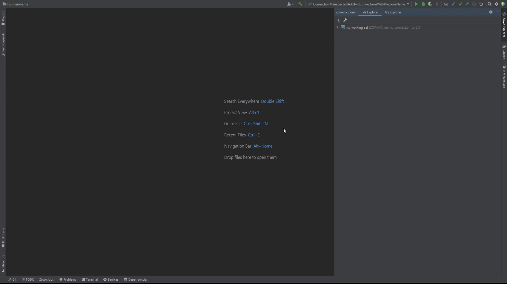

# Working with plug-in's Working Sets

## The concept

We use term "Working Sets" to describe the place to store sets of masks and filters. These items are stored separately for each working set. The working set is more like a "profile" *(don't confuse with the "Zowe Profile")* and is used to logically aggregate sets for different separate needs (both for users' convenience and to separate the different items to categories, in case it is needed).

There are two types of working sets:
- **Files Working Sets** - are to store z/OS and USS masks
- **JES Working Sets** - are to store JES Job filters

You can create working sets either through **Settings** or by clicking **+** button and selecting **Working Set** / **JES Working Set** from a dropdown in the plug-in's tab.

:::note
You can create a working set only when a connection is set up.
:::

## Files Working Set

This type of working sets is used to store z/OS and USS masks. **Masks** are similar to filters, they are used to show z/OS data sets and USS files under a specified path.

To create Files working set:

1. Press **+** button
2. Select **Working Set**
3. Type the Working Set's name in the **Working Set Name** field (it should be unique) and select the connection under which to create the Working Set
4. Add some masks to the newly created Working Set. It can be both z/OS data set masks or USS Files masks
5. Click **OK**

## JES Working Set

This type of Working Sets is used to operate with your JES Jobs, see their logs, view and edit JCL and later run it. It holds all the filters for the JES Explorer.

To create JES Working Set:

1. Select the **JES Explorer** tab
2. Press **+** button
3. Select **JES Working Set**
4. Type the Working Set's name in the **Working Set Name** field (it should be unique) and select the connection under which to create the Working Set
5. Add some **JCL filters**
6. Click **OK**

