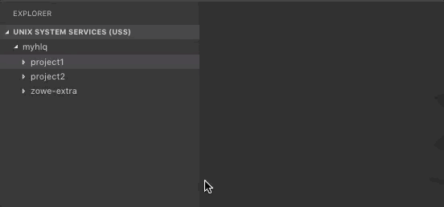
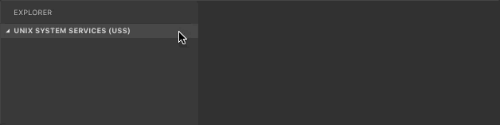
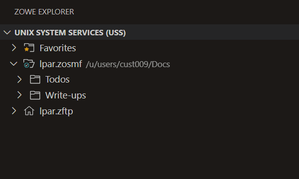

# Working with USS files

## Viewing and accessing multiple USS profiles simultaneously

1. Expand the **UNIX SYSTEM SERVICES (USS)** tree in the **Side Bar**, and click the **+** icon.
2. Select or enter a profile in the **Quick Pick** menu to add it to the **Side Bar**.

   The profile displays in the **Side Bar**.

   

## Viewing Unix System Services (USS) files

1. Expand the **UNIX SYSTEM SERVICES (USS)** tree in the **Side Bar**.
2. Click on the **Search** icon next to a profile and enter the path of the desired directory.

   All child files and directories of that path display under the profile in the **Side Bar**.

   :::note
  
   You cannot expand directories or files to which you are not authorized.

   :::

   

## Dragging and dropping USS files

To select one or more files or folders in the tree and drag them to a folder or session to relocate them:

1. Expand the **UNIX SYSTEM SERVICES (USS)** tree in the **Side Bar**.
2. Click on the **Search** icon next to a profile and enter the path of the desired directory.

   All child files and directories of that path display under the profile in the **Side Bar**.
3. Select the files or folders you want to move.
   - Select multiple items by pressing the `Ctrl` key as you select each item.
   - Select a continuous range of items by selecting the first item in the range. Then hold down the `Shift` key until selecting the last item in the range.
4. Click and hold the region containing the selected items to start the drag process.
5. As the items are selected, move your cursor to the desired folder or session. Release the mouse button to start the move operation.
   - If the move operation might overwrite one or more files, an “overwrite confirmation" message displays. Select **Confirm** to relocate these items. Select **Cancel** to stop the move operation.
   - Items can be moved across different profiles or LPARs, which may cause a brief delay due to the transfer process. 
6. When items are moved, the tree view refreshes and the moved items appear in the destination folder.

   

## Refreshing the list of files

1. Hover over **UNIX SYSTEM SERVICES (USS)** in the **Side Bar**.
2. Click the **Refresh All** button.

   The list of directories and child files is updated to reflect the latest changes.

   

## Renaming USS files

1. Expand the **UNIX SYSTEM SERVICES (USS)** tree in the **Side Bar**.
2. Click on the **Search** icon next to a profile and enter the path of the desired directory.

   All child files and directories of that path display under the profile in the **Side Bar**.

3. Select a USS file you want to rename.
4. Right-click the USS file and select the **Rename USS file** option.
5. In the **input box**, enter the new name of the USS file and press the `Enter` key.

   The file is renamed and the new name displays in the **Side Bar**.

## Copying and pasting USS folders and files

1. Expand the **UNIX SYSTEM SERVICES (USS)** tree in the **Side Bar**.
2. Click on the **Search** icon next to a profile and enter the path of the desired directory.

   All child files and directories of that path display under the profile in the **Side Bar**.
3. Select the files or folders you want to move.
   - Select multiple items by pressing the `Ctrl` key as you select each item.
   - Select a continuous range of items by selecting the first item in the range, then hold down the `Shift` key until selecting the last item in the range.
4. Right-click the selected items and select the **Copy** option from the menu
5. Navigate in the USS tree to the folder where you want to paste the files.

   Files can be moved across different profiles or LPARs, which may cause a brief delay due to the transfer process.
6. Right-click on the folder and select the **Paste** option from the menu.

   The copied items display in the new location.

## Downloading, editing, and uploading existing USS files

1. Expand the **UNIX SYSTEM SERVICES (USS)** tree in the **Side Bar**.
2. Click on the **Search** icon next to a profile and enter the path of the desired directory.

   All child files and directories of that path display under the profile in the **Side Bar**.
3. Click on the file name of the file you want to download.

   The file contents display in an **Editor**.

   :::note

   If you define file associations with syntax coloring, the suffix of your file is marked up.

   :::

4. Edit the document in the **Editor**.
5. Press the `Ctrl`+`S` or `Command`+`S` keys to save the changes.

   The changes are saved and the USS file is uploaded to the mainframe.

   

## Uploading a local file to a USS directory

1. Expand the **UNIX SYSTEM SERVICES (USS)** tree in the **Side Bar**.
2. Click on the **Search** icon next to a profile and enter the path of the desired directory.

   All child files and directories of that path display under the profile in the **Side Bar**.

3. Right-click on the desired directory and select the **Upload Files...** option to upload one or more local files to the directory.

   A file explorer window opens.
4. In the file explorer, select the desired file(s) and click **Upload Files**.

   The selected file(s) is uploaded to the USS directory and appears as new file name in the **UNIX SYSTEM SERVICES (USS)** tree.

## Comparing USS files

1. Expand the **UNIX SYSTEM SERVICES (USS)** tree in the **Side Bar**.
2. Click on the **Search** icon next to a profile and enter the path of the desired directory.

   All child files and directories of that path display under the profile in the **Side Bar**.
3. Right-click on the desired file and select the **Select for Compare** option.
4. Right-click a second file and select the **Compare with Selected** option.

   The first selected file displays in an **Editor** on the left; the second file displays on the right.

## Creating and deleting USS files and directories

### Creating a directory

1. Expand the **UNIX SYSTEM SERVICES (USS)** tree in the **Side Bar**.
2. Click on the **Search** icon next to a profile and enter the path of the desired directory.

   All child files and directories of that path display under the profile in the **Side Bar**.

3. Right-click the desired directory and select the **Create Directory** option.
4. Enter the directory name in the **input box**.
5. Press the `Enter` key to create the directory.

   A new directory is created and displays in the selected directory.

### Creating a file

1. Expand the **UNIX SYSTEM SERVICES (USS)** tree in the **Side Bar**.
2. Click on the **Search** icon next to a profile and enter the path of the desired directory.

   All child files and directories of that path display under the profile in the **Side Bar**.

3. Right-click the desired directory and select the **Create File** option.
4. Enter the file name in the **input box**.
5. Press the `Enter` key to create the directory.

   A new file is created and displays in the selected directory.

### Deleting a file

1. Expand the **UNIX SYSTEM SERVICES (USS)** tree in the **Side Bar**.

2. Click on the **Search** icon next to a profile and enter the path of the desired directory.

   All child files and directories of that path display under the profile in the **Side Bar**.

3. Right-click on the file you want to remove.
4. Select the **Delete** option and click **Delete** again to confirm and delete the file.

   The file is deleted and no longer displays in the selected directory.

### Deleting a directory

1. Expand the **UNIX SYSTEM SERVICES (USS)** tree in the **Side Bar**.

2. Click on the **Search** icon next to a profile and enter the path of the desired directory.
3. Right-click the directory you want to remove.
4. Select the **Delete** button and click **Delete** again to confirm and delete the directory and all its child files and directories.

   The directory is deleted and no longer displays in the **Side Bar**.

   
