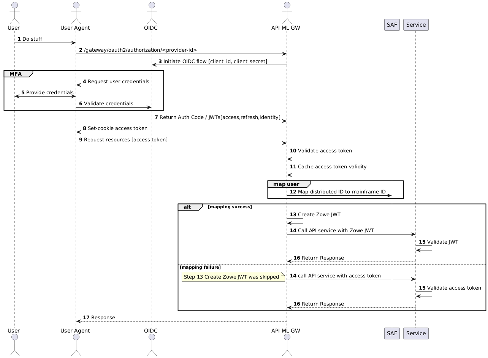

# Authenticating with OIDC 

:::info Required roles: system administrator, security administrator
:::

The OpenID Connect ([OIDC](https://openid.net/specs/openid-connect-core-1_0.html)) protocol adds an identity layer on top of the [OAuth2](https://www.rfc-editor.org/rfc/rfc6749) Authorization protocol.

OIDC authentication, together with the z/OS [Identity Propagation](https://www.redbooks.ibm.com/redbooks/pdfs/sg247850.pdf) mechanism, is the foundation of the API Mediation Layer (API ML) Identity Federation.
In this article, OIDC is often referred to as the provider, while the token-related functionality is actually provided by the OAuth2 component of the OIDC implementation.

You can configure Zowe API ML to authenticate users by accepting Access Tokens issued by an external OIDC provider.
This configuration is useful in advanced deployments of Zowe where client applications need to access mainframe as well as enterprise/distributed systems while simultaneously offering single sign-on (SSO) across system boundaries.  

This article details the API ML OIDC authentication functionality, and describes how to configure the OIDC Authentication feature.

:::note
There is a limitation with respect to performing authentication using Z Secure Services (ZSS) with ACF2 systems. If you are using ACF2, use the recommended internal API ML mapper described in the [API ML OIDC configuration](#api-ml-oidc-configuration) section.
:::

- [Usage](#usage)
- [Authentication flow](#authentication-flow)
- [Prerequisites](#prerequisites)
  - [ESM configuration](#esm-configuration-prerequisites)
- [API ML configuration](#api-ml-oidc-configuration)
  - [OIDC client configuration](#oidc-client-configuration)
  - [OIDC resource server configuration](#oidc-resource-server-configuration)
- [Troubleshooting](#troubleshooting)

## Usage
API ML functions as an OIDC client application, enabling users to initiate the OIDC authentication flow.
After successful user login, the OIDC provider grants the client application a JWT Access Token along with a JWT Identity Token.
The access token is then returned to the user agent in the "apimlAuthenticationToken" cookie.
The user agent can pass this Access Token with subsequent requests to mainframe services routed through the API ML Gateway.
The API ML Gateway then validates the OIDC Access Token. If the token is valid, the user identity from that token is mapped to the mainframe identity of the user.
The API ML Gateway can then create mainframe user credentials (e.g. JWT, PassTicket) according to the service's authentication schema configuration or forward a valid OIDC access token if the user is not mapped. 
The request is routed to the target API services with correct mainframe user credentials.

## Authentication Flow

The following diagram illustrates the interactions between the participants of the OIDC based API ML authentication process.



### Workflow description between OICD participants

1. The user accesses the agent.
2. The user agent requests the client application without valid authentication or an access token.
3. The client redirects the user agent to the login end-point of the distributed OIDC provider.
4. The user is asked to provide valid credentials (authentication factors).
5. The user provides credentials.
6. The agent sends these credentials to the OIDC provider for validation.
7. After successful validation of all authentication factors, the OIDC provider grants the client an Access Token.
8. The client application replies with an access token in the `set-cookie` header.
9. The user agent can then request from API ML Gateway the needed mainframe resources presenting the access token in the request.
10. The Gateway validates the access token in one of two ways:
    1. By cryptographically validating the token using the public key retrieved from the authorization server's JSON Web Key Set (JWKS) endpoint, matching the token's key ID with the key IDs provided. (`components.gateway.apiml.security.oidc.validationType: JWK`).

       **Notes:** 
       * The URL to the specific authorization server's JWKS endpoint should be set using the property `components.gateway.apiml.security.oidc.jwks.uri`.

       * The interval can be set using the property `components.gateway.apiml.security.oidc.jwks.refreshInternalHours`. (The default value is one hour.)

    2.  By querying the `UserInfo` endpoint to verify the token's validity and retrieve user information (`components.gateway.apiml.security.oidc.validationType: endpoint`).

        **Note:** The URL to the specific authorization server's `UserInfo` endpoint should be set using the property `components.gateway.apiml.security.oidc.userInfo.uri`.
11. The Gateway caches the valid access token.
12. The Gateway maps the distributed identity from the access token to the z/OS identity.

**When user mapping exists**

13. The API ML Gateway generates mainframe user credentials (Zowe JWT, SAF IDT, or PassTicket) which are expected by the target mainframe service.
14. Calls the API with credentials.
15. Services validates generated mainframe credentials.
16. The requested data is returned.
17. The requested data is returned to the user agent.

**When user mapping does not exist**

14. The API ML Gateway calls the requested mainframe service/s with the access token in the `OIDC-token` header. 
15. The service validates the `OIDC-token`. 
16. The requested data is returned.
17. The requested data is returned to the user agent.

## Prerequisites

Ensure that the following prerequisites are met:  

- Users who require access to mainframe resources using OIDC authentication have a mainframe identity managed by SAF/ESM.
- SAF/ESM is configured with mapping between the mainframe and distributed user identities. For details, see the section [ESM configuration](#esm-configuration-prerequisites) in this topic.	
- If you are using Zowe release 2.14 or a later release, ensure that the API ML Gateway is configured to use the internal mapper functionality. For information about enabling the API ML mapper, see [Configure internal API ML mapper](../../user-guide/api-mediation/configuration-client-certificates.md#configure-internal-api-ml-mapper). Alternatively, enable ZSS in the Zowe installation, however using the internal mapper is the recommended method. ZSS is enabled by default.
  
### OIDC provider prerequisites

- **Client Application configuration in the OIDC provider**

  Depending on the OIDC provider and client application capabilities, configuration of the OIDC provider varies.
For example, web applications with a secure server side component can use `code grant authorization flow` and can be granted a Refresh Token, whereas a Single Page Application running entirely in the User Agent (browser) is more limited regarding its security capabilities.  

  :::tip
  Consult your OIDC provider documentation for options and requirements available for your type of client application.
  :::

- **Users have been assigned to the Client Application**

  To access mainframe resources, users with a distributed authentication must either be directly assigned by the OIDC provider to the client application, or must be part of group which is allowed to work with the client application.

### ESM configuration prerequisites

The user identity mapping is defined as a distributed user identity mapping filter, which is maintained by the System Authorization Facility (SAF) / External Security Manager (ESM).
A distributed identity consists of two parts:

1. A distributed identity name
2. A trusted registry which governs that identity

Administrators can use the installed ESM functionality to create, delete, list, and query a distributed identity mapping filter or filters.

Ensure that all the security configuration prerequisites are met by following the steps described in [configure the main Zowe server to use distributed identity mapping](../../user-guide/configure-zos-system.md#configure-main-zowe-server-to-use-distributed-identity-mapping).

Use the commands specific to your ESM to create a distributed identity mapping filter.

:::note
User specified parameters are presented in the section [Parameters in the ESM commands](#parameters-in-the-esm-commands).
:::

**For RACF**

<details> 
<summary> Click here for RACF configuration details.</summary>


```markup
  RACMAP ID(userid) MAP USERDIDFILTER(NAME('distributed-identity-user-name')) REGISTRY(NAME('distributed-identity-registry-name' )) WITHLABEL('label-name')

  SETROPTS RACLIST(IDIDMAP) REFRESH
 ```

  For more details about the RACMAP command, see [RACMAP command](https://www.ibm.com/docs/en/zos/2.3.0?topic=rcs-racmap-create-delete-list-query-distributed-identity-filter).

</details>

**For Top Secret**

<details> 
<summary> Click here for Top Secret configuration details.</summary>

```markup
  TSS ADD(userid) IDMAP(ZWEDNMAP) IDMAPDN('distributed-identity-user-name') - <br>
  IDMAPRN('distributed-identity-registry-name') IDLABEL('label-name')

  TSS REFRESH
```

For more details about mapping a distributed identity username and a distributed registry name to a Top Secret ACID, see [IDMAP Keyword - Implement z/OS Identity Propagation Mapping](https://techdocs.broadcom.com/us/en/ca-mainframe-software/security/ca-top-secret-for-z-os/16-0/administrating/issuing-commands-to-communicate-administrative-requirements/keywords/idmap-keyword-implement-z-os-identity-propagation-mapping.html).

</details>


**For ACF2**

<details> 
<summary> Click here for ACF2 configuration details.</summary>

```markup
  ACF
  SET PROFILE(USER) DIVISION(IDMAP)
  INSERT userid.ZWEDNMAP IDMAPDN(distributed-identity-user-name) -
  IDMAPRN(distributed-identity-registry-name) IDLABEL(label-name)

  F ACF2,REBUILD(USR),CLASS(P),DIVISION(IDMAP)
  END
```

  For more details about mapping a distributed user to a logonid, see [IDMAP User Profile Data Records](https://techdocs.broadcom.com/us/en/ca-mainframe-software/security/ca-acf2-for-z-os/16-0/administrating/administer-records/user-profile-records/idmap-user-profile-records.html).

</details>

#### Parameters in the ESM commands

- **userid**  
   Specifies the ESM user id.
- **distributed-identity-user-name**  
   Specifies the user ID for distributed-identity-registry.
- **distributed-identity-registry-name**  
   Specifies the registry value under which the user is defined in the ESM.
- **label-name**  
   Specifies the name for the distributed-identity mapping filter.

   **Example for RACF:**

   ```markup
   RACMAP ID(ab00001) MAP USERDIDFILTER(NAME('aaa.bbb@richradioham.com')) REGISTRY(NAME('zowe.org')) WITHLABEL('identity mapping for ab00001')
   ```

Alternatively, API ML provides a Zowe CLI plug-in to help administrators generate a JCL for creating the mapping filter specific for the ESM installed on the target mainframe system. These JCLs can be submitted on the corresponding ESM to create a distributed identity mapping filter.

For details about how to use the plug-in tool to set up mapping in the ESM of your z/OS system, see the [Identity Federation CLI plug-in](../../user-guide/cli-idfplugin.md) documentation.

## API ML OIDC configuration

### OIDC client configuration

The Gateway service can be configured to provide OIDC client functionality and initiate the OIDC authentication flow to obtain an access token. Provide the following configuration in your zowe.yaml file:

```yaml
components:
 gateway:
   spring:
     security:
       oauth2:
         client:
           registration:
             <provider-id>:
               issuer: <issuer-URL>
               clientId: <client-id>
               clientSecret: <secret>
           provider:
             <provider-id>:
               authorizationUri: <issuer-URL>/v1/authorize
               tokenUri: <issuer-URL>/v1/token
               userInfoUri: <issuer-URL>/v1/userinfo
               userNameAttribute: sub
               jwkSetUri: <issuer-URL>/v1/keys


```
- **provider-id**  
  The ID of the Identity provider. Currently supported options are `okta` and `entra`.
- **components.gateway.spring.security.oauth2.client.registration.\<provider-id>.issuer**    
  The URL of the Token issuer.  
  Example: `https://dev-okta.com/oauth2`.
- **components.gateway.spring.security.oauth2.client.registration.\<provider-id>.clientId**    
  The Client application ID.
- **components.gateway.spring.security.oauth2.client.registration.\<provider-id>.clientSecret**    
  The Client application secret.
- **components.gateway.spring.security.oauth2.client.provider.\<provider-id>.authorizationUri**  
  The URL for the authorization request.
- **components.gateway.spring.security.oauth2.client.provider.\<provider-id>.tokenUri**  
  The URL to obtain the token.
- **components.gateway.spring.security.oauth2.client.provider.\<provider-id>.userInfoUri**  
  The URL to retrieve user information.
- **components.gateway.spring.security.oauth2.client.provider.\<provider-id>.userNameAttribute**  
  The JWT attribute to locate the user ID.
- **components.gateway.spring.security.oauth2.client.provider.\<provider-id>.jwkSetUri**  
  The URL to retrieve the JSON Web Key Set.


:::tip
Consult your OIDC provider documentation for options and requirements available for your type of client application.
:::

### OIDC resource server configuration

Use the following procedure to enable the feature to use an OIDC Access Token as the method of authentication for the API Mediation Layer Gateway.

:::tip
You can leverage the Zowe CLI Identity Federation (IDF) Plug-in for Zowe CLI to extend Zowe CLI to make it easier to map mainframe users with an identity provided by an external identity provider.
This plug-in is designed to work with the ESMs: IBM RACF, Broadcom ACF2, and Broadcom Top Secret.

For more information about the Zowe CLI Identity Federation Plug-in, see the [README file in the api-layer repo](https://github.com/zowe/api-layer/edit/v3.x.x/zowe-cli-id-federation-plugin/README.md).
:::

 In the zowe.yaml file, configure the following properties:

- **components.gateway.apiml.security.oidc.enabled**  
   Set the value to `true` to enable OIDC resource server functionality for authentication.

- **components.gateway.apiml.security.oidc.registry**  
  Specifies the SAF registry used to group the identities recognized as having OIDC identity mapping. The registry name is the string used during the creation of the mapping between the distributed and mainframe user identities. For more information, see **distributed-identity-registry-name** value used in the [ESM configuration](#esm-configuration-prerequisites).

- **components.gateway.apiml.security.oidc.validationType**  
   Specifies the validation type for OIDC authentication functionality, which is set to `JWK` by default. To enable access token validation using a remote endpoint, set this property to `endpoint`. When set to `endpoint`, the Gateway uses the URI sepecified in the property `userInfo` to validate access tokens.
  - For `endpoint` validation type, configure following options
    - **components.gateway.apiml.security.oidc.userInfo.uri**  
       Specifies the URI obtained from the authorization server's metadata where the Gateway queries the userInfo endpoint for access token validation. 
    
  - For `JWK` validation type, configure following options
    - **components.gateway.apiml.security.oidc.jwks.uri**  
      Specifies the URI obtained from the authorization server's metadata where the Gateway will query for the JWK used to sign and verify the access tokens. 
    - **components.gateway.apiml.security.oidc.jwks.refreshInternalHours**  
     (Optional) Specifies the frequency in hours to refresh the JWK keys from the OIDC provider. Defaults to one hour.  

**Example for OKTA:**

```yaml
components:
 gateway:
   apiml:
     security:
       oidc:
         enabled: true
         registry: zowe.org
         validationType: JWK
         jwks:
           uri: https://okta.com/oauth2/api/v1/keys

```
## Troubleshooting

### API ML fails to validate the OIDC access token with the Distributed Identity Provider

**Symptom**  
The Gateway log contains the following ERROR message:  
`Failed to validate the OIDC access token. Unexpected response: XXX.`

- **_XXX_**  
is the HTTP status code returned by the Identity Provider.

**Explanation**  
The HTTP code is one of the 40X variants that provides the reason for the failure.

**Solution**  

Correct the Gateway configuration according to the code returned by the OIDC Identity Provider.

### The access token validation fails with HTTP error

**Symptom**  

The OIDC provider returns an HTTP 40x error code.

**Explanation**  

The client application is not properly configured in the API ML Gateway.

**Solution**  
Check that the URL `components.gateway.apiml.security.oidc.jwks.uri` contains the key for OIDC token validation. If `oidc.validationType` is set to `endpoint`, ensure that the `components.gateway.apiml.security.oidc.userInfo.uri` is properly configured and valid.

:::tip
API ML Gateway exposes a validate token operation which is suitable during the OIDC setup. The call to the endpoint `/gateway/api/v1/auth/oidc-token/validate` verifies if the OIDC token is trusted by API ML. Note that the Gateway service does not perform the mapping request to the ESM when the `/gateway/api/v1/auth/oidc-token/validate` endpoint is called.

Use the following curl command to make a REST request with the OIDC token to the validate token endpoint:

```shell
curl --location 'https://"$HOSTNAME:$PORT"/gateway/api/v1/auth/oidc-token/validate --data '{"token": "$OIDC_TOKEN","serviceId": "$SERVICE_ID"}'
```

An HTTP `204` code is returned if the validation passes. Failure to validate returns an HTTP `40x` error.
:::

:::note Azure Entra ID OIDC notes:
API ML uses the `sub` claim of the ID Token to identify the user, and to map to the mainframe account. Note that the structure of the `sub` claim varies between the Azure token and the OKTA ID token:
- The Azure token `sub` is an alphanumeric value.  
For more information, see the topic _Use claims to reliably identify a user_ in the Microsoft Learn documentation.
- The OKTA ID token has an email in the `sub` claim.

For more information about Entra ID token format see _ID token claims reference_ in the Microsoft documentation.
:::
