# Copying and moving data using the plug-in

The essential feature of the plug-in is to provide the ability to copy and move content between different entities and systems. The plug-in provides functionalities to copy and move any kind of information possible (also in terms of security).

## Copy and move: the same system

There are different options to copy and move z/OS data sets and members between each other, as well as USS files. It is possible to move and copy files and data sets either through keyboard shortcut buttons and context menu, or using **Drag & Drop**.

### Copy and move: a data set member copy and move examples

:::important note
Make sure the parameters of the target data set allow you to paste a new member. Sometimes there is an error occures during paste operation to the data set due to the directory blocks value being not enough to fit the member.
:::

To copy member from one data set to another:
1. Right click on the member to be copied, select **Copy**

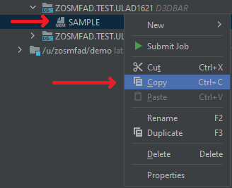

2. Right click on the target PDS / PDS/E data set, select **Paste**

3. A dialog about the copy operation appears. It is also possible to cancel the operation until it is finished

4. After the operation is completed, the data set will be automatically refreshed and the member will appear in the list of the data set members

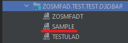

To move a member from one data set to another:
1. Right click on the member to be moved, select **Cut**

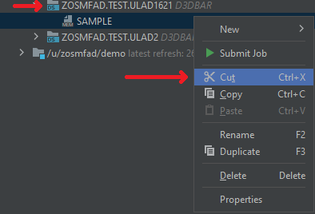

2. Right click on the target PDS / PDS/E data set, select **Paste**

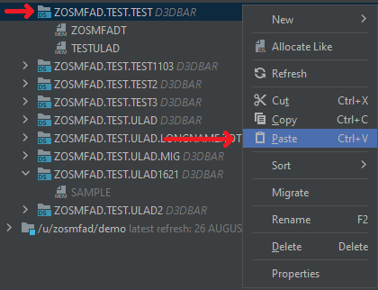

:::note
You can use a **Drag & Drop** feature to accomplish the same action
:::

3. A confirmation dialog for the member to be moved will appear, select **Yes**

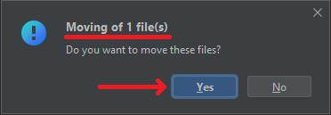

4. A dialog about the move operation appears. It is also possible to cancel the operation until it is finished

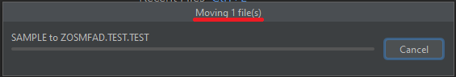

5. After the operation is completed, the data set will be automatically refreshed and the member will appear in the list of the data set members

The member will disappear from the source data set.

### Copy and move: a PS data set to a PDS member copy example

The plug-in allows to copy and move PS data sets to PDS / PDSE data sets. The data set will become a member of the target data set. The name of the member will be trimmed to the last element of the source HLQ. If there are already a member with the same name as the newly pasted one has, the name will be changed to the same data set member's name with the last character(s) replaced with the next available number to form a non-conflicting name of the member.

:::important note
Make sure the parameters of the target data set allow you to paste a new member. Sometimes there is an error occures during paste operation to the data set due to the directory blocks value being not enough to fit the member.
:::

To copy a sequential data set to a partitioned data set:
1. Right click on the PS to be copied, select **Copy**

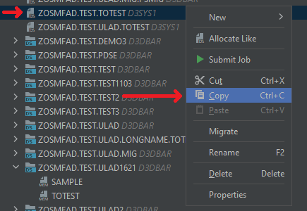

2. Right click on the target PDS / PDS/E data set, select **Paste**

3. If there is a conflicting name member in the data set exists, the plug-in will suggest a new name to apply to the member to appear in the data set members list. Click **Ok** to agree to use the new name

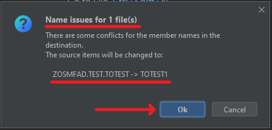

4. A dialog about the copy operation appears. It is also possible to cancel the operation until it is finished

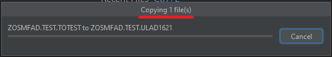

5. After the operation is completed, the data set will be automatically refreshed and the member will appear in the list of the data set members

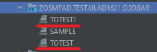

### Copy and move: a USS file to a USS folder move example

To move USS file or folder to another USS folder:
1. Right click on the folder or the file to be moved, select **Cut**

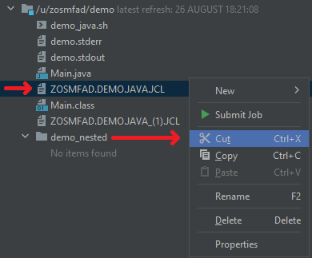

2. Right click on the target USS folder, select **Paste**

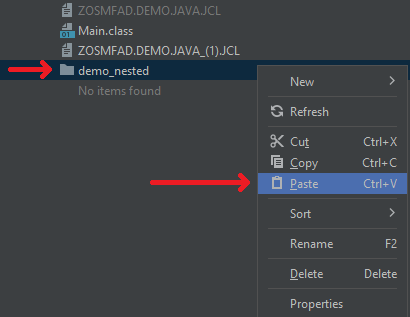

:::note
You can use a **Drag & Drop** feature to accomplish the same action
:::

3. A confirmation dialog for the file to be moved will appear, select **Yes**

4. A dialog about the move operation appears. It is also possible to cancel the operation until it is finished

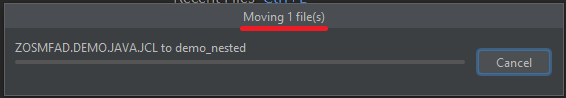

5. After the operation is completed, the path will be automatically refreshed and the file will appear in the refreshed list. Also the file will disappear from the source path

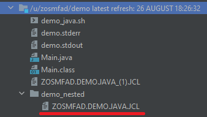

### Copy and move: a PDS / PDS/E member to a USS folder copy example

There is also a functionality provided by the plug-in to copy and move PS, PDS / PDS/E data sets and members to a USS path.

To copy a PDS / PDS/E member to a USS folder:
1. Right click on the member to be copied, select **Copy**

2. Right click on the target USS folder, select **Paste**

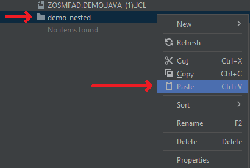

3. A dialog about the copy operation appears. It is also possible to cancel the operation until it is finished

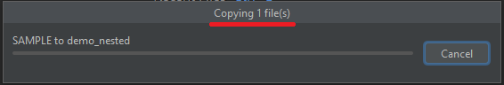

4. After the operation is completed, the USS path will be automatically refreshed and the newly pasted USS file will appear

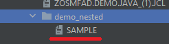

### Copy and move: a PDS / PDS/E data set to a USS folder move example

While moving or copying a partitioned data set to the USS path, it will be converted to a USS folder with USS files.

To move a PDS / PDS/E data set to a USS path:
1. Right click on the PDS to be copied, select **Cut**

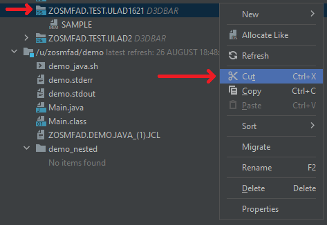

2. Right click on the target USS folder, select **Paste**

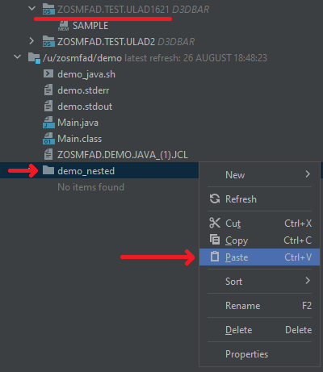

:::note
You can use a **Drag & Drop** feature to accomplish the same action
:::

3. A confirmation dialog for the file to be moved will appear, select **Yes**

4. A dialog about the move operation appears. It is also possible to cancel the operation until it is finished

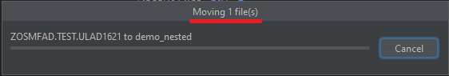

5. After the operation is completed, the path will be automatically refreshed and the folder will appear in the refreshed list. Also the data set will disappear from the z/OS part

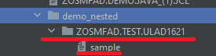

### Copy and move: a USS file to a PDS / PDS/E data set move example

Also, it is possible to copy and move a USS file to a PDS / PDS/E data set. The file will become a PDS member.

:::important note
The contents of the source files and data sets will stay the same, until you try to copy/move a file from USS to a z/OS partitioned data set. If the file lines are longer than the specified for the PDS / PDS/E logical record length, the plug-in will cut the rest of the line, exceeding the LRECL, for each of the exceeding lines.
:::

To move a USS file to a PDS / PDS/E data set:
1. Right click on the file to be copied, select **Cut**

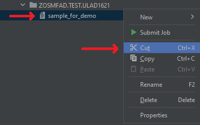

2. Right click on the target PDS / PDS/E data set, select **Paste**

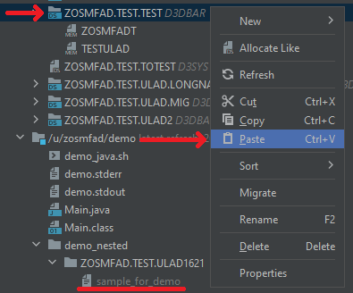

:::note
You can use a **Drag & Drop** feature to accomplish the same action
:::

3. A confirmation dialog for the file to be moved will appear, select **Yes**

4. Also, the warning dialog about placing a USS file under a PDS / PDS/E data set will appear. It will describe the actual result of this operation. Click **Ok**

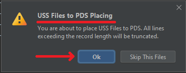

5. A dialog about the move operation appears. It is also possible to cancel the operation until it is finished

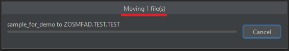

6. After the operation is completed, the data set will be automatically refreshed and the list of the members will be refreshed with the new member in the list present. Also the file will disappear from the USS path

:::note
You could notice the new member name. It is formed from the first 8 alphanumeric characters of the source file. Also, when there are member name conflicts, there is a resolution mechanism implemented in the plug-in. The new name will be formed as the change of the conflicting name, adding the next available number to the new name of the new member.
:::

## Cross-system copy and move

The plug-in provides a functionality to move and copy z/OS data sets and USS files between different systems. E.g.: a user has two systems with different IPs. So, it is possible to copy or move files and data sets either from the first IP to the second, or vice versa. The rules of copying and moving that are described previously, are the same for this action.

### Copy and move: a PDS / PDS/E data set to a USS path cross-system copy example

To copy a PDS / PDS/E data set to a USS path in a different system:
1. Right click on the data set to be copied, select **Copy**

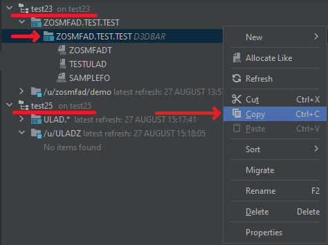

2. Right click on the target system's USS path, select **Paste**

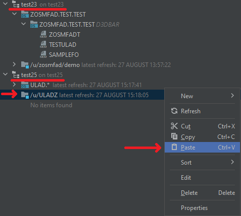

3. A dialog about the copy operation appears. It is also possible to cancel the operation until it is finished

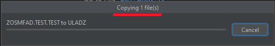

4. After the operation is completed, the USS path will be automatically refreshed and the path will be refreshed with the new USS folder in the list present

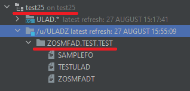

## Downloading USS files and folders and z/OS data sets and members

There is a feature to download USS files and folders, as well as z/OS data sets and members. Both **Copy** and **Cut** functionalities are available for the downloading feature.

### Download feature: a USS file download as a copy operation

To copy a USS file to a local machine:
1. Right click on the z/OS system's USS file, select **Copy**

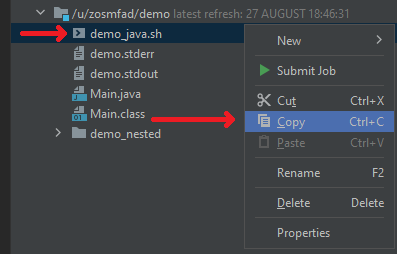

2. Right click in the local project's explorer view, select **Paste**

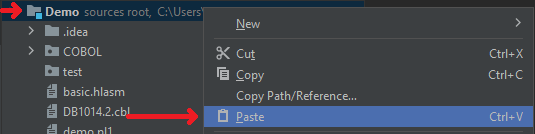

3. If there are conflicts in the names of the entities being copied, the plug-in will ask for the option to select:
    - **Skip the conflicting file(s) (1)** - will skip the entities copying
    - **Replace the file(s) in the destination (2)** - will replace the entities in the destination with the being copied ones
    - **Decide for each file (3)** - will ask separately for each entity being copied

For the example purposes, select **Decide for each file (3)**

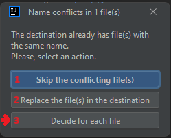

4. The next dialog window will appear, asking what to do with the conflicting file:
    - **Skip (1)** - will skip the entity copying
    - **Overwrite (2)** - will overwrite the entity with the same name in the destination
    - **Use new name (3)** - will create a new entity as a copy of the entity being copied with a new name, provided by the plug-in

For the example purposes, select **Use new name(3)**

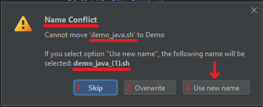

5. The final warning dialog will appear, notifying that the operation may be against the security rules in your company. Select **Yes**

:::warning do it on your own risk!
Do not proceed with the operation if your organization does not allow you to distribute information from your mainframe. It may contain sensitive data that is not meant to be distributed outside a mainframe.
:::

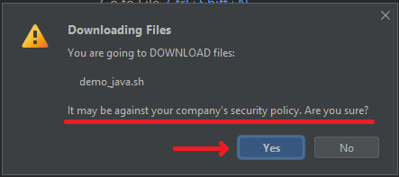

6. A dialog about the copy operation appears. It is also possible to cancel the operation until it is finished

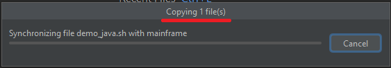

7. After the operation is completed, the file will appear in your local project's tree

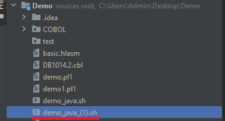

## Uploading files to a USS subsystem and z/OS data sets

It is also possible with the plug-in to upload files to a USS path and z/OS data set as a member

### Upload feature: a file to a PDS / PDS/E member upload as a copy operation

:::important note
Make sure the parameters of the target data set allow you to paste a new member. Sometimes there is an error occures during paste operation to the data set due to the directory blocks value being not enough to fit the member.
:::

:::important note
The contents of the source files and data sets will stay the same, until you try to copy/move a file from USS to a z/OS partitioned data set. If the file lines are longer than the specified for the PDS / PDS/E logical record length, the plug-in will cut the rest of the line, exceeding the LRECL, for each of the exceeding lines.
:::

To upload a file as a copy operation from a local machine to a PDS / PDS/E data sets as a member:
1. Right click on a file on the local project's tree, select **Copy**

2. Right click on the destination PDS / PDS/E, select **Paste**

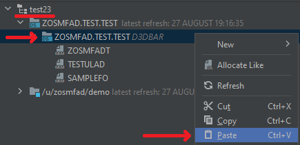

3. The truncation warning will appear, click **Ok**

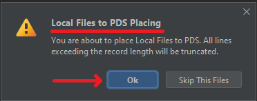

4. A dialog about the copy operation appears. It is also possible to cancel the operation until it is finished

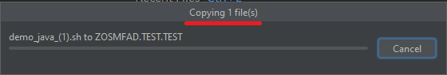

5. After the operation is completed, a new member will appear in the destination PDS / PDS/E

:::note
Check the content of the member after the operation. It could be truncated due to LRECL of the data set.
:::

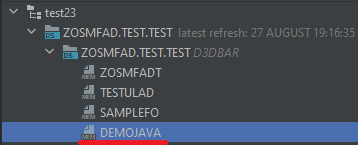

## Current limitations

There are still some features in development and are not possible to accomplish with the plug-in:
1. **Folder uploading to a USS path**
2. **File uploading to a z/OS mask as a PS data set**
3. **USS folder copy to a z/OS mask as a PDS / PDS/E data set**
4. **Folder uploading to a z/OS mask as a PDS / PDS/E data set**

If you have some ideas regarding these operations or want to make a change in the existing one, please, [reach out to us](https://openmainframeproject.slack.com/archives/C020BGPSU0M).
