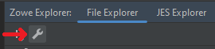
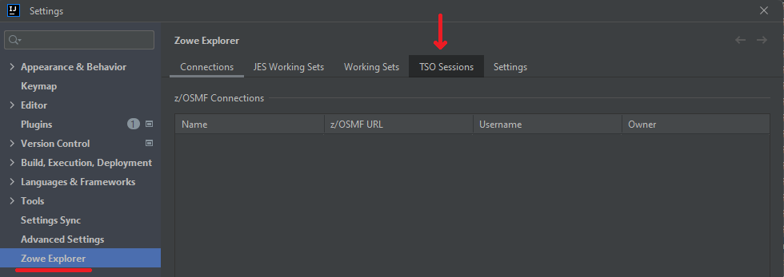
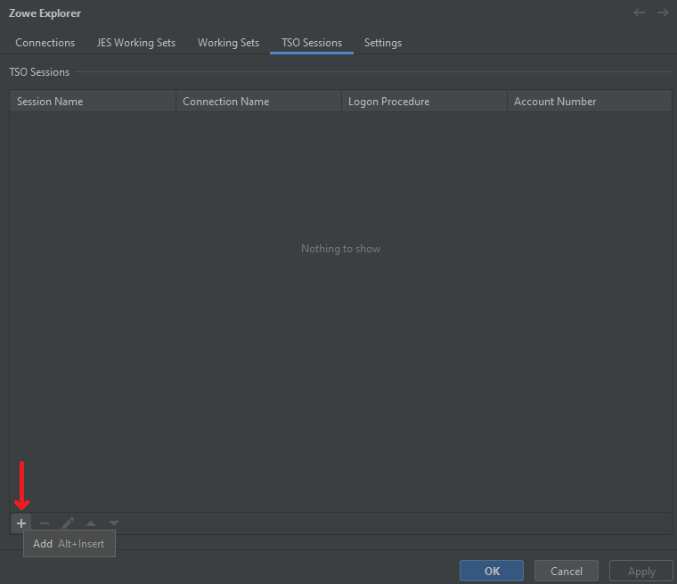
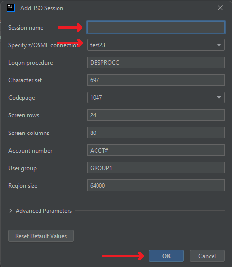
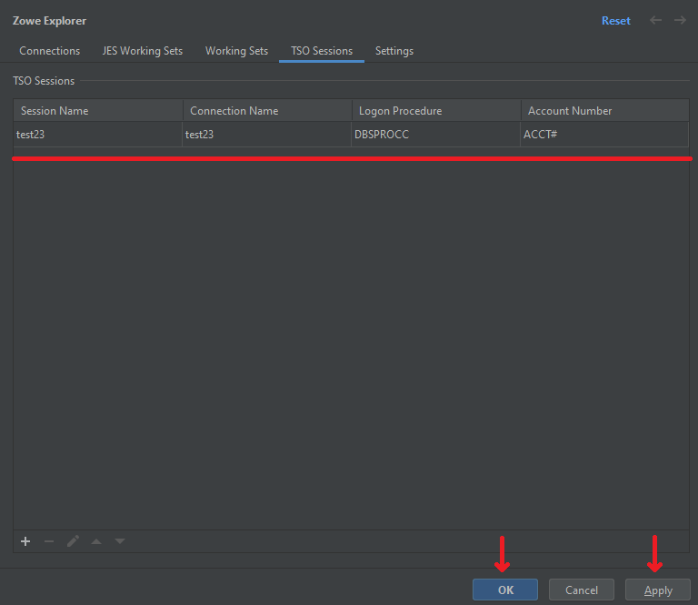
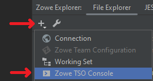
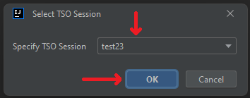
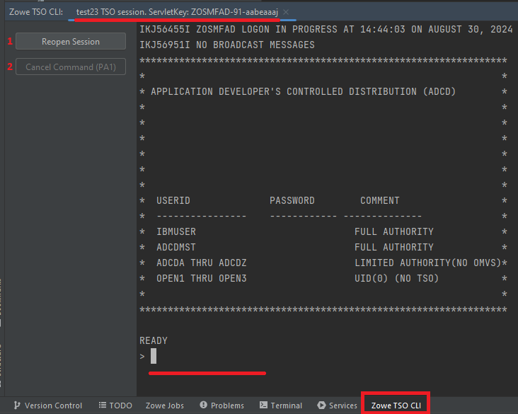

# Working with TSO console

The plug-in provides a functionality to work with TSO in a console way directly from the IntelliJ IDEA. With this feature it is possible to enter commands and see their results, open multiple sessions to different z/OS instances, as well as the same z/OS instance, issue a PA1 command to the console in case the attention functionality is needed to be triggered.

To start working with TSO console, you need to set up a [Connection](./intellij-configure.md#creating-zosmf-connection). After that, the **TSO Sessions** functionality will be allowed to work with.

## Creating a TSO Session

To create a TSO Session:
1. Open settings with the wrench button

2. Go to **TSO Sessions** tab

3. At the **TSO Sessions** tab, click on the **+** button

4. The **Add TSO Session** dialog will appear. You need to specify a name of the TSO Session in order to be able to create it. Also, you can select a connection to be used together with the session parameters. To setup such things as reconnection timeout and reconnection attempts count, use the **Advanced Parameters** section. Also, you can reset the defaults of the parameters by clicking **Reset Default Values** button. After all the parameters are set up, click **OK** button

5. After the actions are done, a new **TSO Session** will be added to the list. Click **Apply** and then **OK** buttons to save the new session

## Creating a TSO Console

After a [**TSO Session**](./intellij-tso-cli.md#creating-a-tso-session) is created, it is possible to create a **TSO Console**.

To create a **TSO Console**:
1. Click **+** button, select **Zowe TSO Console**

2. The **Select TSO Session** dialog will appear. Select the appropriate **TSO Session** to use during a TSO console run, click **OK** button

3. When the **TSO Session** is selected, the **TSO Console** will appear. In there you could see the actual information about the session being used, the welcoming message and the prompt, where it is possible to enter TSO commands. Also there are 2 buttons to manipulate the behavior of the console:
    - **Reopen Session (1)** - will reopen the current TSO Console session with the same parameters
    - **Cancel Command (PA1) (2)** - will send the **PA1** command to the TSO console in order to issue a cancellation of the previous command (it is blocked when there is nothing to cancel)

From this point, you are ready to use the **TSO Console**
