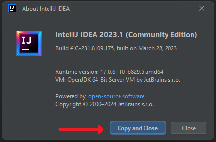
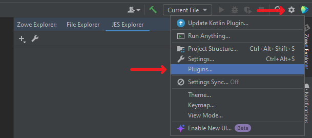

# Troubleshooting Zowe Explorer plug-in for IntelliJ IDEA

As a Zowe Explorer plug-in for IntelliJ IDEA user, you may encounter problems both with the plug-in and the IntelliJ IDEA platform. Our support is open for any type of issues, related to this client-side component. See the next sections as an example of how to react on these problems.

## Troubleshooting IntelliJ IDEA platform issues

Sometimes there could be inconveniences in how your IDE works. Before trying to fix any problem:
1. Go to **Help** > **About**

2. Click **Copy and Close** button and save this information somewhere for later

After that, there are a few steps that could be possibly done to fix the issue:
- **If the issue details are clear and IDE says, which component it is** - copy all the related information and send it to the component's developer
- **If the issue is unclear** - try to reload IDE / your computer. If the problem persists, try to reinstall the IDE or install the newest one supported LTS version of the IDE you are using
- **Ask for help or search for the related issue** - there is [an issue tracker](https://youtrack.jetbrains.com/issues/IDEA), related to the IntelliJ IDEA issues. Try to find something related or create a new one

## Troubleshooting the plug-in

If you have an issue with the plug-in:
1. Click the **gear** button, select **Plugins...**

2. Go to **Installed** tab, locate the plug-in, save **the exact version number**

After these actions, you have some options to try:
- **If the problem occurs for the plug-in in editor** - try to close the file you are editing, refresh the path and open it again
- **If the problem occurs with displaying a mask or a filter** - try to hit refresh on a working set or try to recreate a connection and a working set
- **If the problem occurs for some other issues related to Files Explorer or JES Explorer** - try to recreate a new connection, and a new working set for it
- **If the problem occurs for TSO Console** - try to reopen the session, try to recreate a session entirely
- **Other non-related issues, e.g. if the problem occurs for encoding or permissions or "Internal IDE error" notification appears constantly** - copy all the necessary information about the IDE you use and the plug-in's version, [create a new issue](https://github.com/zowe/zowe-explorer-intellij/issues) listing all the necessary information (like the steps to recreate the issue) as well as the versions, or search for the related issue in the repository and put a thumb-up for it, so we know that it should have a higher priority

If you want a direct consulting, don't hesitate to visit our [Slack channel](https://openmainframeproject.slack.com/archives/C020BGPSU0M) and leave a message. Our team is always willing to help with any issues related to the platform or the plug-in, no matter the size of an issue or a question.
