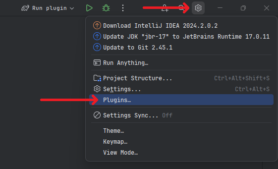
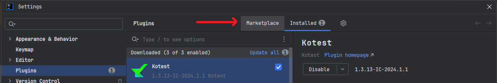
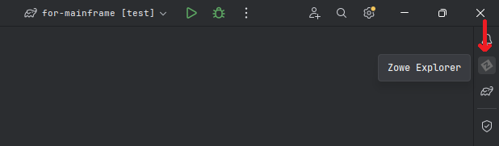
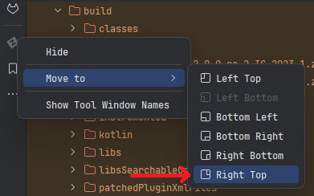
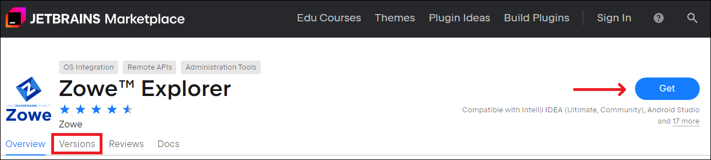
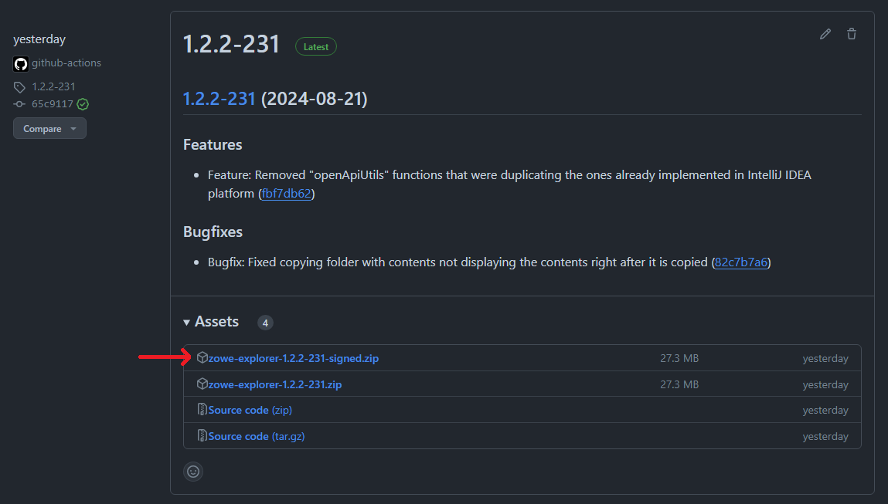
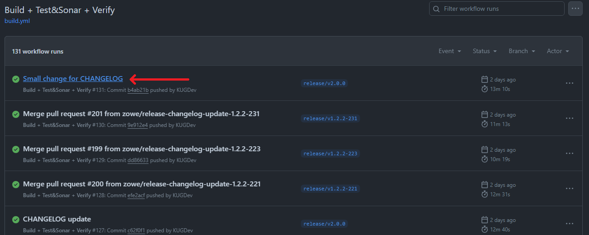
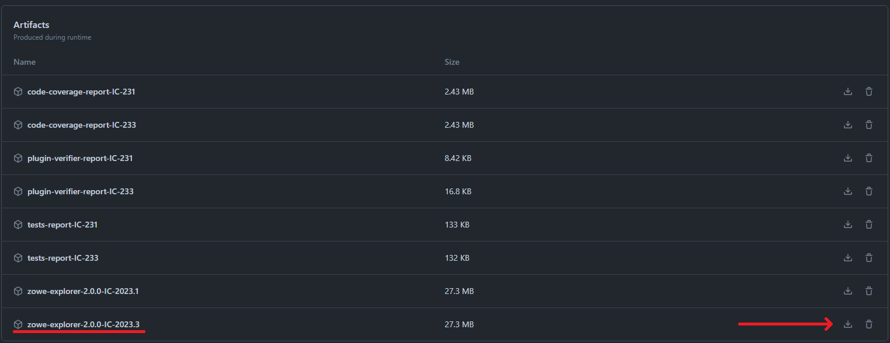
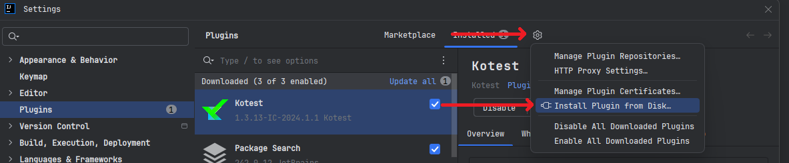
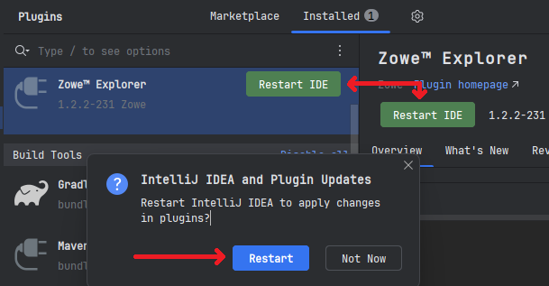

# Installing the plug-in

There are two ways to install the plug-in:
1. **(Preferred)** Install the plug-in directly inside IntelliJ IDEA
2. Download and install binaries either from [JetBrains Marketplace page](https://plugins.jetbrains.com/plugin/18688-zowe-explorer) or from our [GitHub repository](https://github.com/zowe/zowe-explorer-intellij)

## Installing inside IntelliJ IDEA

To install the plug-in from IntelliJ:

1. At the right top corner click the gear button and from the dropdown list select the **Plugins** option

2. Select the **Marketplace** tab on top of the window

3. Type **Zowe Explorer** and click **Install**.

4. Wait until the plug-in is installed, then click **Restart IDE**. IntelliJ IDEA will ask you if you want to restart the IDE to applly all the changes in plugins. Select **Restart**, wait until the IDE is restarted

After the IDE is restarted, the plug-in's icon will appear at the right top corner. It means that you are ready to work with it.

:::note
Sometimes the plug-in's icon appear at some different place, other than the right top corner. To fix it, right-click on the icon, in the **Move To** dropdown select the **Right Top** option.

:::

## Downloading binaries

:::warning ALWAYS DOUBLE-CHECK THE BINARIES YOU ARE TRYING TO INSTALL! 
We are responsible for the genuine software provided by the zowe community only. If you have any questions regarding the installation or the usage of the plug-in, feel free to contact any person directly related to Zowe
:::

There are three ways of downloading binaries of the Zowe Explorer plug-in for IntelliJ IDEA:
1. [JetBrains Marketplace page](https://plugins.jetbrains.com/plugin/18688-zowe-explorer)
2. [GitHub Releases](https://github.com/zowe/zowe-explorer-intellij/releases) of our repository
3. [GitHub Actions](https://github.com/zowe/zowe-explorer-intellij/actions) of our repository

### Downloading binaries from JetBrains Marketplace page

1. Proceed to the [JetBrains Marketplace page](https://plugins.jetbrains.com/plugin/18688-zowe-explorer) of the plug-in
2. Click **Get** button or select the **Versions** tab

3. Select the compatibility option and the channel of the distribution:
    - **Stable** - the stable versions of the plug-in
    - **EAP** - the *Early Access Program* versions of the plug-in, sometimes are provided for the EAP versions of the IntelliJ IDEA
    - **Preview** - the next versions of the plug-in, that contain the bleeding-edge features of the plug-in, which may be unstable
  

4. Select the version of the plug-in you want to download, click **Download** button against it

### Downloading binaries from GitHub Releases

1. Proceed to the [GitHub Releases](https://github.com/zowe/zowe-explorer-intellij/releases) of the repository
2. Select the release version you want to install and click on the .zip file to download the binary

:::note
Prefer the "*-signed.zip" over the regular one
:::

### Downloading binaries from GitHub Actions

:::note
You need to be logged into a GitHub account to be able to download artifacts
:::

1. Proceed to the [GitHub Actions](https://github.com/zowe/zowe-explorer-intellij/actions) of the repository
2. Select a build workflow

3. Select the build of a branch you want to download

4. At the bottom of the page, in the *Artifacts* section, select the .zip file with the version build to download

## Installing binaries

After the .zip is downloaded, do the next steps:
1. At the right top corner click the gear button and from the dropdown list select the **Plugins** option

2. Near the **Installed** tab, click the gear button, from the dropdown select the **Install Plugin from Disk** option

3. In the **Choose Plugin File** dialog window, search for the .zip you want to install. Select it and click **OK** button

4. The plug-in will appear in the **Installed** tab, click the **Restart IDE** button, and then the **Restart** button in the dialog window.

After the IDE is restarted, the plug-in's icon will appear at the right top corner. It means that you are ready to work with it.

:::note
Sometimes the plug-in's icon appear at some different place, other than the right top corner. To fix it, right-click on the icon, in the **Move To** dropdown select the **Right Top** option.

:::
