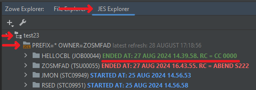
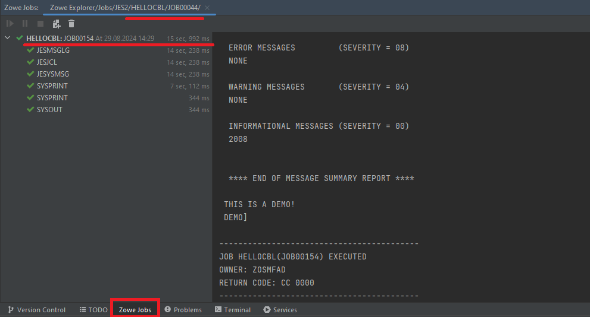
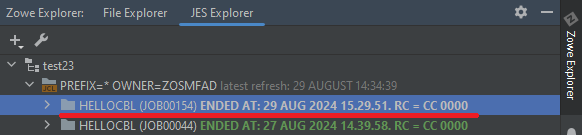
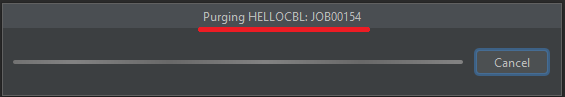
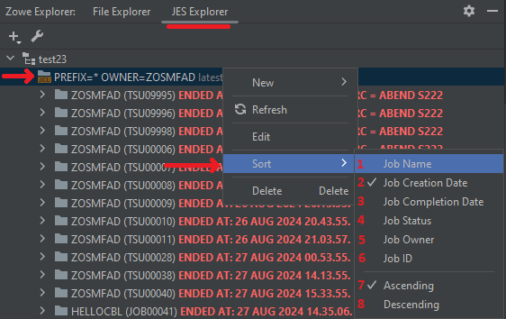

# Working with JES Explorer

Using the plug-in, you will be able to:
- view a status of a job, view full log of a job run
- view and edit job's JCL, submit a JCL right after they are edited
- purge a job
- sort jobs

After you set up a [JES Working Set](./intellij-working-sets.md#jes-working-set) and create a job filter to display jobs, you are all set up to work with JES Explorer.

## Creating a jobs filter

To see and manipulate JES jobs, you need to specify a jobs filter to search for jobs.

To create a jobs filter:
1. Proceed to the **JES Explorer**, right click on a **JES Working Set**, select **New > Jobs Filter**

2. Specify the parameters in the **Create Jobs Filter** dialog:
    - **Prefix (1)** - the prefix for a jobs search. Can be specified as a wildcard
    - **Owner (2)** - the owner for a jobs search. Can be specified as a wildcard
    - **Job ID (3)** - the exact job ID for a job search

:::note
You can specify either **prefix + owner** or a **job ID** only. A mix of the parameters is not allowed.
:::

After the parameters are specified, click **OK**

Now, you are ready to proceed to work with JES jobs.

## Viewing a job status

The job status is displayed depending on the actual status of the job with the respective colouring.

To view a job status:
1. Proceed to the **JES Explorer**, reveal a **JES Working Set** and a **Jobs Filter**. There are different statuses depending on the state of a job:
    - <b style={{ color: 'green' }}>ENDED AT: \<date and time\>. RC = CC 0000</b> - the job is ended successfully, displaying the actual date and time of the job finish
    - <b style={{ color: 'red' }}>ENDED AT: \<date and time\>. RC = \<any other\></b> - the job is ended with an error or a warning, displaying the actual date and time of the job finish
    - <b style={{ color: 'blue' }}>STARTED AT: \<date and time\></b> - the job is started but is in progress and not yet completed, displaying the actual date and time of the job start
    - <b style={{ color: 'gold' }}>PENDING INPUT</b> / <b style={{ color: 'gold' }}>QUEUED</b> - the job is not started yet as it is waiting in the queue until the same job already started is finished

## Viewing job spool files and job's run logs

All the spool files available for the jobs could be viewed in the plug-in.

To view the job spool files:
1. At the **JES Explorer** tab, reveal a JES Working Set and a jobs filter

2. Double click on the job or click **>** on the left of it. You will see all the spool files, available for the job

:::note
If the job is still in progress, it is possible that not all the spool files are available yet. Just wait until the job is finished and refresh the view by right clicking and selecting **Refresh**.
:::

3. Double click on any of the spool files to see the content of it. The lines will be displayed in the editor in a reader mode

To view all the spool files merged in one log:
1. Right click on the job in **JES Explorer**, select **View Job**

2. The merged spool files log will be displayed in the **Zowe Jobs** console view. There are two buttons to manipulate the job in there:
    - **Go To Job (1)** - reveals the job in **JES Explorer**. If the job is not yet visible in the JES Explorer, the plug-in provides a dialog to create a filter for the exact job to present
    - **Purge Job (2)** - removes the job from JES

:::note
If the job is completed successfully, the plug-in can hide the successful steps. To show them, right click on the job in the console view and select **Show Successful Steps** and it will show all the spool files of the job as steps.
:::

## View and edit job's JCL code

The plug-in provides the possibility to view and edit a JCL code of the job in the JES Explorer. The JCL will appear in the IDE's editor. You could change the JCL and submit the job with a new code.

To view and edit the JCL code of a JES job:
1. Right click on the job in **JES Explorer**, select **Edit JCL**

2. After the JCL content is fetched, it will be displayed in the IDE's editor. You can change the JCL as much as you want. Also, the editor allows to submit the JCL again. Click the **Submit Job** button

3. When the job is submitted, the console of the job's execution will appear, providing the actual information about the job run

4. Also, it is possible to see the status of the job being run. On the appropriate **Job Filter** in the **JES Explorer**, right click and select **Refresh**

5. After refresh is completed, a new list with jobs will be displayed with the submitted job and its respective status

## Purge a job

To purge a job from a JES:
1. Specify a **Jobs Filter**. After the jobs are fetched, right click on a job to purge, select **Purge** (or press **Delete** button when the job is selected)

2. When the job is being purged, a "purge" dialog will appear until the job is purged

3. After the job is purged, a notification about the job is purged will appear and the **Jobs Filter** will be refreshed

## Sort jobs

For the improved user experience, there is a feature of the plug-in to sort jobs for a specified jobs filter.

To sort jobs:
1. Proceed to the **JES Explorer**, reveal a **Jobs Filter**, right click on it, select **Sort**. There are will be options:
    - **Job Name (1)** - to sort jobs by their names
    - **Job Creation Date (2)** - to sort jobs by their creation date and time. Jobs are sorted by this option by default
    - **Job Completion Date (3)** - to sort jobs by their completion date and time
    - **Job Status (4)** - to sort jobs by their status. It means that the return code will be analyzed by the status, displayed in the JES Explorer
    - **Job Owner (5)** - to sort jobs by their owners
    - **Job ID (6)** - to sort jobs by their IDs

Also, there is a possibility to change the order for the items to be displayed: **Ascending (7)** (by default) or **Descending (8)**. For the example purposes, select **Job Name**

2. The list will be refreshed with the new sort order

