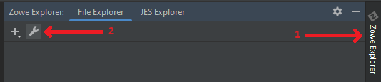
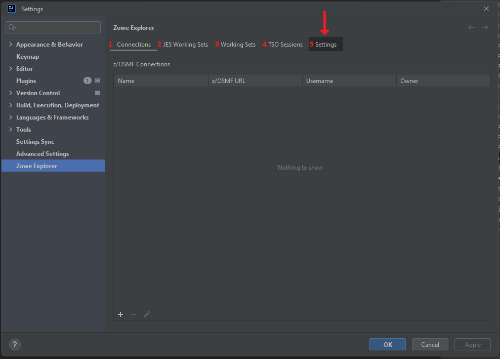

# Working with plug-in's settings

Before you start to use the plug-in, there are some settings that will help you to customize the way you are working with it. To open the plug-in's settings:
1. Open the **Zowe Explorer** tab **(1)**, click the **Settings** button **(2)**. The action will open all the configurations of the plug-in

2. After the window of the configuration appears, there are some tabs:
- **Connections (1)** - to manage the connections to z/OS you have. From there, you can add a new connection and delete or edit the old one
- **JES Working Sets (2)** - to manage the JES Working Sets
- **Working Sets (3)** - to manage the Files Working Sets
- **TSO Sessions (4)** - to manage TSO Sessions
- **Settings (5)** - the actual customization options of the plug-in

Click the **Settings** tab to proceed to the customization options

3. At the **Settings** tab, there are two available customization options:
- **Batch amount to show per fetch (1)** - the amount of data sets to show under a mask. The option is editable and accepts integer numbers
- **Enable auto-sync with mainframe (2)** - the option to save content of the edited data sets and USS files automatically if selected

## Batch amount to show per fetch

There could be a huge amount of data sets / files under a specified mask. Sometimes the loading of their list could take a lot of time. To eliminate this problem, the plug-in provides the ability to control the amount of items loading at one time. The option is called **Batch amount to show per fetch**. By default, it is set to **100** entries. It means that when the request to display entities under a mask contains more than the specified number, it will show the first "x" entities with the button to load more of them. You can load the next amount by double-clicking on the **load more** at the bottom of the list.

## Enable auto-sync with mainframe

It is possible to synchronize the file or data set you are editing either manually or automatically. The method of synchronizing is controlled by the **Enable auto-sync with mainframe** option. When it is marked, you don't need to manually synchronize the file / data set whilst editing it, the plug-in decides by itself, when to synchronize it. In case you want to be sure that you control the process of synchronizing the content with a mainframe, or in case you have some limitations for calls to z/OSMF REST API, or for some other reason, you can disable this option and continue with manual synchronization. The synchronization process starts either by the button in the editor (), appearing if there are any changes in the file, or by pressing simultaneously **Ctrl + Shift + S (Cmd + Shift + S for MacOS)**.

If the manual synchronization is turned on, and you try to close the file in the editor, the plug-in will ask what to do with the content. Clicking **Yes** will synchronize the content, **No** will delete the local changes:

Here's how auto-synchronization works:

