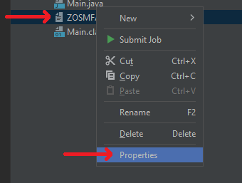
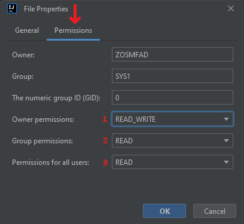
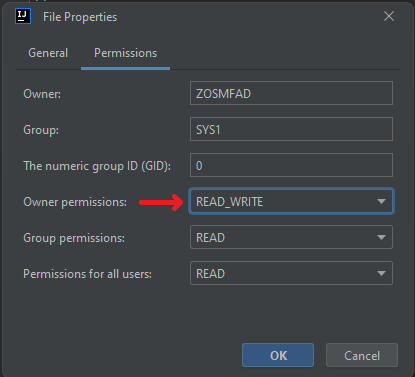
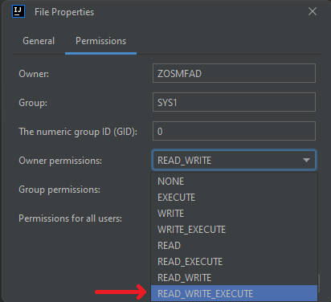
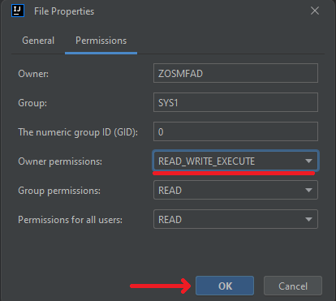
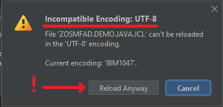
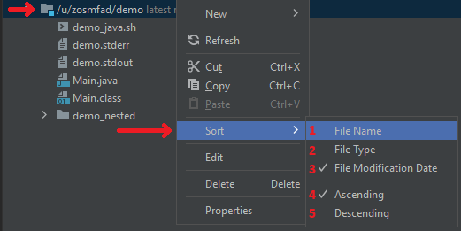
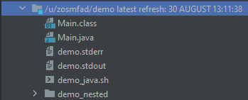

# Working with USS Files

Using the plug-in, you will be able to:
- create, rename, view, edit, delete USS files and folders
- submit JCL jobs with **Submit Job** option
- change the encoding a USS file content is displayed or saved in
- manipulate USS files and folders rights
- copy, move USS files and folders, both inside the filesystem, and between them, as well as between systems with different IP address
- sort USS paths

After you set up a [Files Working Set](./intellij-working-sets.md#files-working-set) and create a mask to display USS paths, it is possible to manipulate USS files and folders.

## Basic operations

The plug-in allows users to work with USS part of a mainframe. As the basic operations, you can create files with a specific set of permits, edit files, rename and delete them. Also, you can submit a job from a USS file if it is a JCL.

## Working with permissions

The plug-in allows users to edit permissions of the USS files and folders:
1. Right-click on the file in USS explorer, click **Properties**

2. In the **File Properties** dialog window, select the **Permissions** tab

3. In there, you will have three options to change when needed: **Owner permissions (1)**, **Group permissions (2)** and **Permissions for all users (3)**. To change any of the options, click one of them

4. From the drop-down list, select a new value

5. Click the **OK** button for the changes to be applied

## Working with files encoding

Sometimes it is necessary to display file content in a specific encoding or save it in some different encoding. To do so:
1. Double-click the USS file to open it in the editor

2. In the **File Properties** dialog window, you should be at the **General** tab. Click the **File encoding** button for the drop-down list to appear

3. Select the encoding you want the file content to be in

4. After the actions, the encoding change dialog will appear. It will ask you to choose between the 2 options:
    - **Reload (1)** - changes the file tag, specifying the encoding to show the file in. This action does not actually rewrite the contents of the file and just changes the way it is displayed in the editor
    - **Convert (2)** - tries to convert the file to the specified encoding, actually changing the content of the file. This option will also change the file tag, and after that it will try to modify the content, changing the file bytes to the respective ones to try to display the same content with the actually different bytes

5. Click the option you want to perform on the file. Sometimes it is not possible to correctly reload or convert the file content to the encoding you select. In this case, the *Warning* icon will appear in the button of an action that is not possible to perform correctly. You will be still able to perform the operation, but the additional warning dialog will appear, describing the issue

:::warning make sure you know what you are doing
The contents after clicking **Reload anyway** or **Convert anyway** could be unpredictable. Do it only in the cases where you are sure nothing will go wrong.
:::

After the operation is finished, the content of the file will be reloaded. If you had some characters that were not visible in the default encoding, and you selected the correct encoding, the content will be displayed regarding the option you've selected.

## Sort a USS path

There is a functionality of the plug-in to sort USS files and folders. The plug-in allows to sort not only the root path, but any USS path you have in your working tree.

To sort USS files and folders list:
1. Right click on a USS path, select **Sort**. The list of sorting options will appear:
    - **File Name (1)** - to sort USS entities by name
    - **File Type (2)** - to sort USS entities by type
    - **File Modification Date (3)** - to sort USS entities by modification date. USS path is sorted by this option by default

Also, there is a possibility to change the order for the items to be displayed: **Ascending (4)** (by default) or **Descending (5)**. For the example purposes, select **File Name**

2. The list will be refreshed with the new sort order

