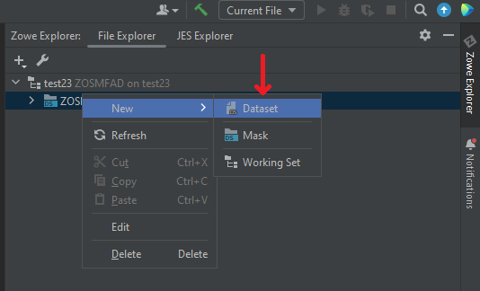
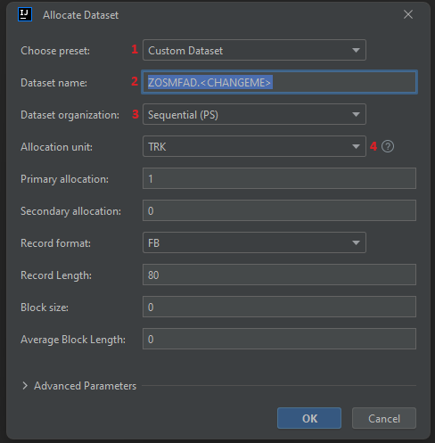
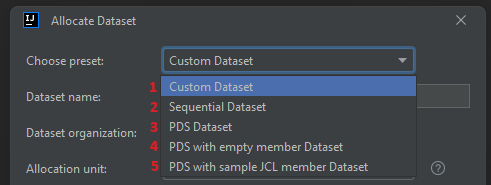
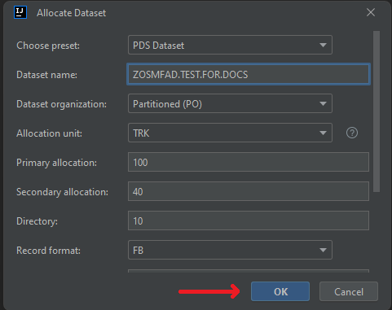
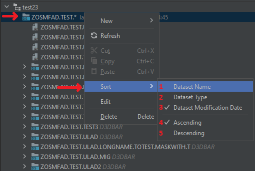

# Working with z/OS data sets

Using the plug-in, it is possible to:
- create, rename, view, edit, delete PS, PDS, PDS/e data sets, as well as PDS and PDS/e members
- use the feature **Allocate Like** to create a data set with parameters of the other data set
- use the feature **Migrate** and **Recall** for archived data sets
- submit JCL jobs with **Submit Job** option
- copy, move z/OS data sets, both inside the filesystem, and between them, as well as between systems with different IP address
- sort data sets

After you set up a [Files Working Set](./intellij-working-sets.md#files-working-set) and create a mask to display data sets on the z/OS part, it is possible to manipulate PS, PDS and PDS/E data sets

## Allocating a data set

To allocate a data set:
1. Right-click on any entity, related to z/OS data sets (it could be **Files Working Set**, **z/OS data sets mask**, any **other data set or member**)
2. Select **New** -> **Dataset**

3. Specify the necessary fields. There are some custom options to help with specifying the data set parameters:
    - **Choose preset (1)** - the option provides the most commonly used data set presets both for PS and PDS options. Selecting on of the presets will automatically setup all the necessary fields to create the selected type of a data set (the presets are described more later)
    - **Dataset name (2)** - the name of the data set to be created. It automatically provides the template of the data set name with the user's HLQ as the starting string and **.\<CHANGEME\>** string that is intended to be changed by the user
    - **Dataset organization (3)** - the data set organization to be used. The options are: **PS (Physical Sequential)**, **PO (Partitioned Organization)** and **PO-E (Partitioned Organization - Extended)**
    - **Allocation unit hint (4)** - a small UI improvement hint for better understanding the allocation units and their relative values to each other

All the other parameters are the same as the z/OS provides to allocate a new data set. In the **Advanced Parameters** section, there are some additional fields to setup if your prefer to set yourself such things as **Volume**, **Device Type**, **Storage class**, etc.

If you want to choose a preset, there are 5 options available for now:
  - **Custom Dataset (1)** - all the fields are set by the user
  - **Sequential Dataset (2)** - the fields are set to allocate a template PS data set
  - **PDS Dataset (3)** - the fields are set to allocate a template PDS data set
  - **PDS with empty member Dataset (4)** - the fields are set to allocate a template PDS data set with an empty member inside
  - **PDS with sample JCL member Dataset (5)** - the fields are set to allocate a template PDS data set with a member with a template JCL job inside

4. After specifying all the necessary fields, click **OK**

5. When the data set is allocated, the plug-in will suggest creating a mask to display the data set created under. Click **Add mask (1)** to add the mask and **Skip (2)** to skip the mask creation

## Working with z/OS PS data sets

Here you can see a possible scenario of working with PS data sets

## Working with z/OS PDS / PDS/E data sets

Here you can see a possible scenario of working with PDS / PDS/E data sets

## "Allocate Like" feature

To issue the **Allocate Like**, right-click on any of data sets and select **Allocate Like**.

## "Submit Job" feature

To issue the **Submit Job**, right-click on any of PS data sets or PDS / PDS/E members and select **Submit Job**.

## Sort a data sets mask

To sort z/OS data sets list:
1. Right click on a data sets mask, select **Sort**. The list of sorting options will appear:
    - **Dataset Name (1)** - to sort by data set names
    - **Dataset Type (2)** - to sort by data set types (PS / PO / PO-E)
    - **Dataset Modification Date (3)** - to sort by data set modification date and time. Data sets list is sorted by this option by default

Also, there is a possibility to change the order for the items to be displayed: **Ascending (4)** (by default) or **Descending (5)**. For the example purposes, select **Dataset Name**

2. The list will be refreshed with the new sort order

