# Zowe architecture

Zowe&trade; is a collection of components that together form a framework that makes Z-based functionality accessible across an organization. Zowe functionality includes exposing Z-based components, such as z/OSMF, as REST APIs. The Zowe framework provides an environment where other components can be included and exposed to a broader non-Z based audience.

Zowe components can be categorized by location: server or client. While the client is always an end-user tool such as a PC, browser, or mobile device, the server components are installed on z/OS, most of which run subsequently under USS.

## API Mediation Layer

Zowe API Mediation Layer (API ML) functions as a secure, single point of entry for mainframe infrastructure REST APIs, which bridges the gap between underlying z/OS services and modern application development. API ML provides an alternative to requiring clients to manage individual connections and credentials for various mainframe endpoints. Instead, all traffic is routed centrally through Zowe API ML.

### Core Components

Zowe API Mediation Layer is comprised of the following components:

* API Gateway 
* Discovery Service
* API Catalog
* Caching Service
* Zowe Authentication & Authorization Service (ZAAS)

The following diagram illustrates the internal relationships between these core API ML components and how they interact with external services and clients.

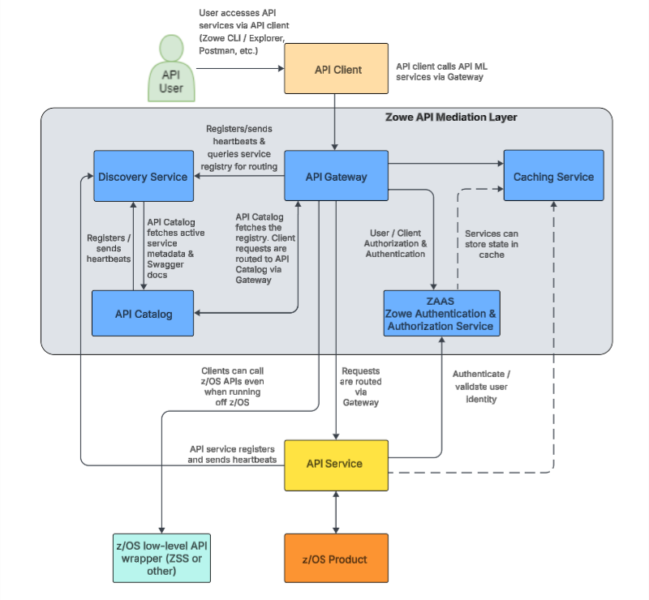

### API Gateway 
The API Gateway is a proxy server and centralized entry point that provides standardized access to mainframe infrastructure REST APIs. The API Gateway dynamically routes requests from clients on its northbound edge (such as web browsers or Zowe CLI) to appropriate servers on the API Gateway's southbound (downstream) edge. Additionally, the API Gateway enforces secure communication and integrates with ZAAS to generate authentication tokens for Single Sign-On (SSO) functionality.

Click here for details about the API Gateway. 

 The API Gateway homepage is `https://<ZOWE_HOST_ADDRESS>:7554`. Following authentication, this URL enables users to navigate to the API Catalog.

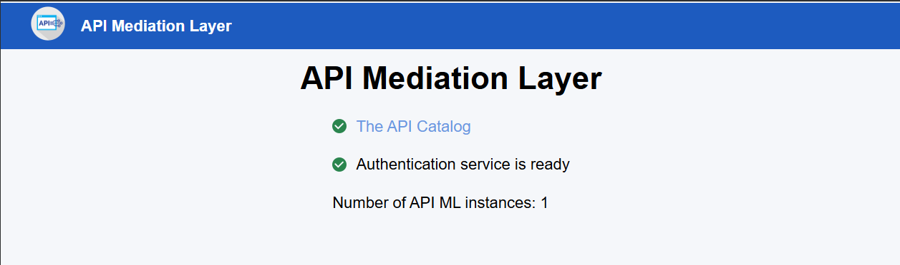

* When the API Gateway is running, this server is accessible at `https://<ZOWE_HOST_ADDRESS>:7554/`.
* When running on z/OS in single-service deployment mode, the server uses the jobname suffix of `GW`.
*  When running in multi-service deployment, the server uses the suffix `AG`.

**Key capabilities of the API Gateway:**

* **Dynamic Routing**  
Acts as a reverse proxy, routing incoming client requests to the appropriate downstream API services based on the routing information dynamically provided by the Discovery Service.
* **Standardized Access**  
Provides a single, consistent entry point (URL and port) for all mainframe infrastructure REST APIs, simplifying client configuration and network security.
* **Security & Authentication Integration**  
Enforces secure communication via HTTPS and acts as the enforcement point for Single Sign-On (SSO), relying on ZAAS to validate identities and issue tokens.

 

### Discovery Service
The Discovery Service is the service registry of active services within Zowe API Mediation Layer. The Discovery Service enables the dynamic registration of API services upon startup, continuously monitors their health and availability via heartbeats, and provides the API Gateway with real-time routing intelligence to support load balancing and high availability.

Click here for details about the Discovery Service. 

* When running in multi-service deployment, the Discovery Service can be accessed through the default URL `https://<ZOWE_HOST_ADDRESS>:7553`, making it possible to view a list of registered API services on the API discovery homepage.
* When running in a single-service deployment, port `7553` operates strictly as an internal port, and all external user requests are handled through the API Gateway on port `7554`.

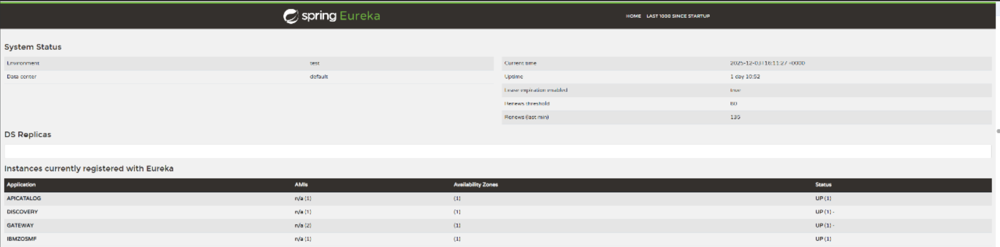

* When running on z/OS in single-service deployment mode, the Discovery Service is part of the API Gateway, which uses the jobname suffix of `GW`.
* When running in multi-service deployment, the Discovery Service uses the suffix `AD`.

**Key capabilities of the Discovery Service:**

* **Registration Management**  
Supports both dynamic and static registration of API services. Dynamic registration allows services to automatically register themselves and their metadata upon startup, while static registration enables onboarding and routing for services that cannot be modified to use a discovery client.
* **Health Monitoring**  
Continuously monitors the health and availability of dynamically registered services by requiring and tracking regular heartbeat signals.
* **Routing Intelligence**  
Maintains the central registry of all active services (both statically and dynamically registered) and provides the API Gateway with real-time routing information, enabling load balancing and high availability.

 

### API Catalog
The API Catalog is a user-friendly web dashboard that provides centralized visibility into all API services registered with Zowe API ML. The API Catalog aggregates and displays service status, versioning details, and Swagger/OpenAPI documentation, while also providing a built-in interactive client that allows developers to test REST API endpoints directly from the browser.

Click here for details about the API Catalog. 

The API Catalog provides a list of the API services that have registered themselves as catalog tiles. These tiles make it possible to view the available APIs from Zowe's southbound (downstream) servers, as well as test REST API calls.  

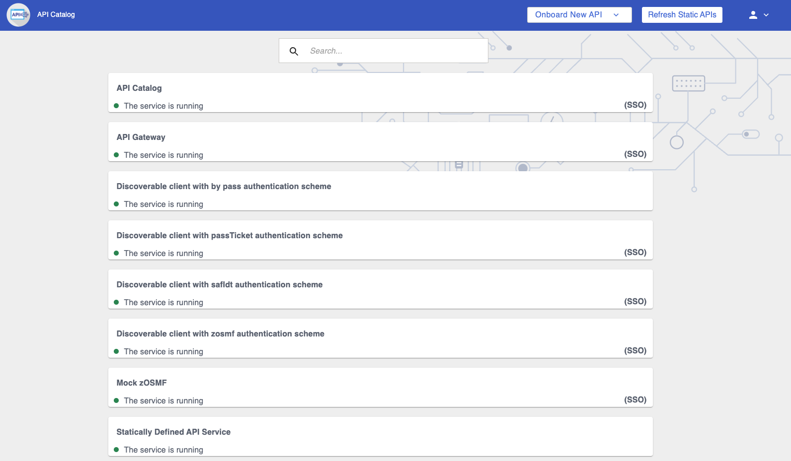

* When the API Gateway is running, this server is accessible at `https://<ZOWE_HOST_ADDRESS>:7554/apicatalog/ui/v1`.
* When the API Catalog is running, the API documentation of this server is accessible at the API Catalog tile `Zowe Applications` which can be viewed at `https://<ZOWE_HOST_ADDRESS>:7554/apicatalog/ui/v1/#/tile/apimediationlayer/apicatalog`
* When running on z/OS in single-service deployment mode, the API Catalog is part of the API Gateway, which uses the jobname suffix of `GW`.
* When running in multi-service deployment, the API Catalog uses the suffix `AC`.

**Key capabilities of the API Catalog:**

* **Centralized Documentation**  
Aggregates and displays Swagger/OpenAPI documentation for all registered services in a single, user-friendly web dashboard.
* **Interactive Testing**  
Provides a built-in interactive client that allows developers to test API endpoints directly from the browser, making it easy to view requests and responses.
* **Service Status Visibility**  
Displays the current operational status, versioning details, and routing information of underlying mainframe services to users and administrators.

 

### Caching Service
The Caching Service is a secure, internal key-value data storage mechanism dedicated to Zowe applications. The Caching Service is designed to support high availability (HA) configurations by allowing Zowe components to remain stateless. By offloading their state to this centralized service, components can share information across multiple instances (such as in a Sysplex or Kubernetes cluster) without exposing sensitive cached data to the public internet.

Click here for details about the Caching Service. 

The Caching service aims to provide an API which offers the possibility to store, retrieve, and delete data associated with keys. The service is used only by internal Zowe applications and is not exposed to the internet. 

For more information about the Caching service, see [Using the Caching Service](../user-guide/api-mediation/api-mediation-caching-service.md).

* When the API Gateway is running, this server is accessible at `https://<ZOWE_HOST_ADDRESS>:7554/cachingservice/api/v1`.
* When the API Catalog is running, the API documentation of this server is accessible at the API Catalog tile `Zowe Applications` which can be viewed at `https://<ZOWE_HOST_ADDRESS>:7554/apicatalog/ui/v1/#/tile/zowe/cachingservice`.
* When configured in a multi-service deployment, the Caching Service runs on its own default port of `7555`.
* When running on z/OS in single-service deployment mode, the Caching Service is part of the API Gateway, which uses the jobname suffix of `GW`.
* When running on z/OS in multi-service deployment mode, the Caching Service uses the jobname suffix of `CS`.

**Key capabilities of the Caching Service:**

* **State Management**  
Provides a centralized key-value data storage mechanism, allowing internal Zowe components to store, retrieve, and share stateful information securely.
* **High Availability Support**  
Enables state sharing across multiple instances of Zowe services (such as in a Sysplex or Kubernetes environment), ensuring a consistent user experience even if traffic is routed to a different instance.
* **Secure Internal Access**  
Operates strictly as an internal service dedicated to Zowe infrastructure and applications, keeping cached data secure and inaccessible from the public network.

 

### Zowe Authentication & Authorization Service (ZAAS)
ZAAS is a core security service that validates user identity and manages access control. Integrating directly with the API Gateway, ZAAS serves as the foundation for Single Sign-On (SSO) by issuing JSON Web Tokens (JWTs) upon validating z/OS credentials. ZAAS also handles PassTicket generation, allowing clients to securely authenticate to downstream Zowe or z/OS services without repeatedly providing base credentials.

Click here for details about ZAAS. 

The Zowe Authentication & Authorization Service (ZAAS) validates user identity and manages access control. It integrates directly with the API Gateway to ensure that incoming client requests are properly authenticated and authorized before they are routed to the appropriate downstream Zowe or z/OS services.

* When configured in a multi-service deployment mode, ZAAS runs on its own default port of `7558`.
* When running in single-service deployment, ZAAS is integrated directly into the API Gateway and accessed via port `7554`.

**Key capabilities of ZAAS:**

* **Single Sign-On (SSO)**  
ZAAS is the central component for the API ML single sign-on. This service produced the access tokens that represent the user during communication with z/OS services.
* **Token Management**  
Upon validating a user's z/OS credentials, ZAAS issues a JSON Web Token (JWT). This token can then be used to authenticate the user in subsequent API calls, eliminating the need to repeatedly provide base credentials.
* **PassTicket Generation**  
In addition to JWTs, ZAAS can obtain and issue PassTickets, providing an alternative, secure authentication method for accessing legacy Zowe-conformant API services.

 

## Single-service API ML deployment

The following diagram illustrates the high-level Zowe architecture using Single-Service API ML deployment. Single-Service deployment is the preferred deployment method.

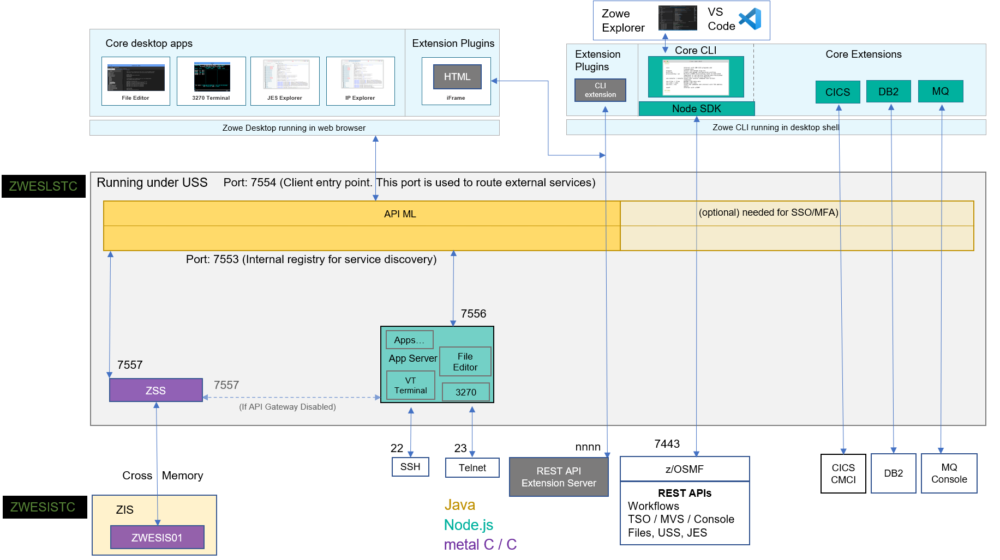
    
The diagram shows the default port numbers that are used by Zowe. These are dependent on each instance of Zowe and are held in the Zowe YAML configuration file.

:::note Multi-service deployment
While single-service deployment is the standard and preferred method for running the API Mediation Layer, Zowe also supports a multi-service deployment architecture where each API ML component runs in its own separate address space. 

Click to view the architecture used in multi-service deployment.

The following diagram illustrates the high-level Zowe architecture using the multi-service deployment method.

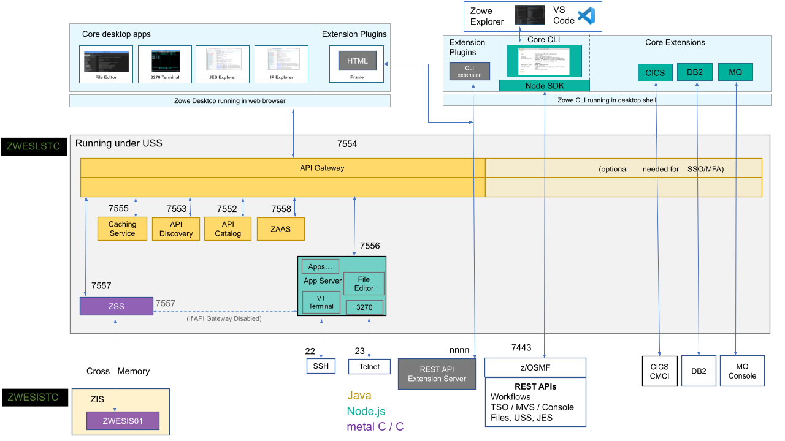

As with the single-service architecture diagram, the diagram for multi-service deployment shows the default port numbers that are used by Zowe. These ports are dependent on each instance of Zowe and are held in the Zowe YAML configuration file.

:::

## Zowe architecture with high availability enablement on Sysplex

The following diagram illustrates the difference in locations of Zowe components when deploying Zowe into a Sysplex with high availability enabled as opposed to running all components on a single z/OS system.  

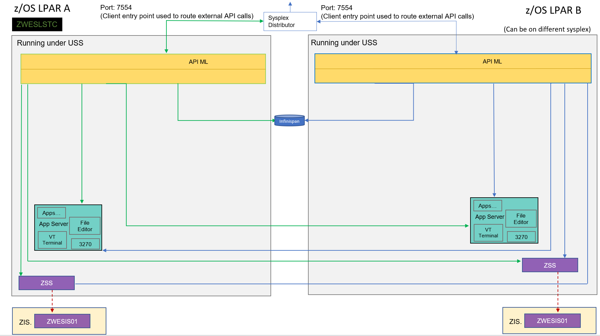

Zowe has a high availability feature built in. To enable this feature, you can define the `haInstances` section in your YAML configuration file.

The preceding diagram shows that `ZWESLSTC` has started two Zowe instances running on two separate LPARs that can be on the same or different sysplexes.  

- Sysplex distributor port sharing enables the API Gateway 7554 ports to be shared so that incoming requests can be routed to either the Gateway on LPAR A or LPAR B.
- The discovery servers on each LPAR communicate with each other and share their registered instances, which allows the API Gateway on LPAR A to dispatch APIs to components either on its own LPAR, or alternatively to components on LPAR B. As indicated in the diagram, each component has two input lines: one from the API Gateway on its own LPAR and one from the Gateway on the other LPAR.  When one of the LPARs goes down, the other LPAR remains operating within the Sysplex, thereby  providing high availability to clients that connect through the shared port irrespective of which Zowe instance is serving the API requests.

The `zowe.yaml` file can be configured to start Zowe instances on more than two LPARS, and also to start more than one Zowe instance on a single LPAR, thereby providing a grid cluster of Zowe components that can meet availability and scalability requirements.  

The configuration entries of each LPAR in the `zowe.yaml` file control which components are started. This configuration mechanism makes it possible to start just the desktop and API Mediation Layer on the first LPAR, and start all of the Zowe components on the second LPAR. Because the desktop on the first LPAR is available to the Gateway of the second LPAR, all desktop traffic is routed there.  

The Caching services for each Zowe instance, whether on the same LPAR, or distributed across the sysplex, are connected to each other by the same shared VSAM data set. This arrangement allows state sharing so that each instance behaves similarly to the user irrespective of where their request is routed.  

## Zowe architecture when running in Kubernetes cluster

The following diagram for single-service deployment illustrates the difference in locations of Zowe components when deploying Zowe into a Kubernetes cluster as opposed to running all components on a single z/OS system.

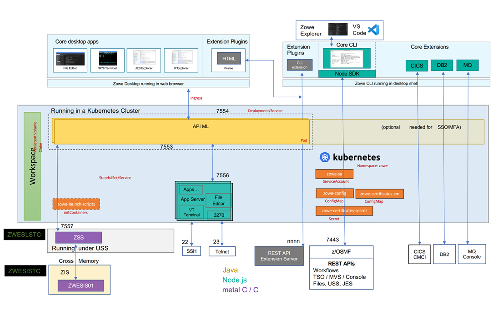

 

Click to view the architecture used in multi-service deployment under Kubernetes.

The following diagram for multi-service deployment illustrates the difference in locations of Zowe components when deploying Zowe into a Kubernetes cluster as an alternative to running all components on a single z/OS system.

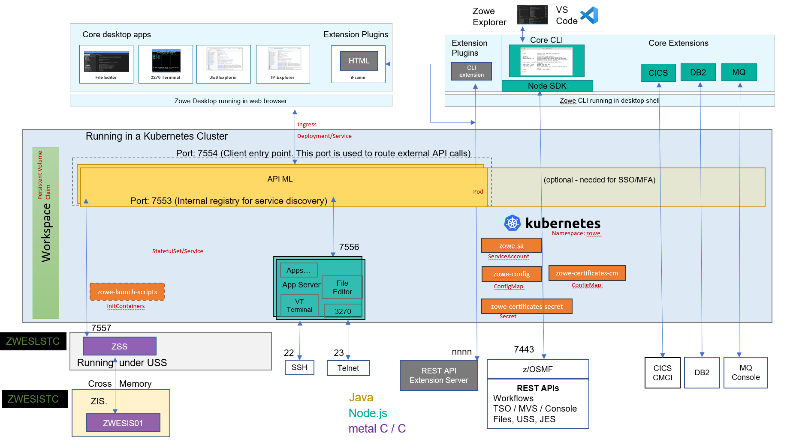

 
 

When deploying other server components into container orchestration software like Kubernetes, Zowe follows standard Kubernetes practices. The cluster can be monitored and managed with common Kubernetes administration methods.

- All Zowe workloads run on a dedicated namespace (`zowe` by default) to distinguish from other workloads in the same Kubernetes cluster.
- Zowe has its own `ServiceAccount` to help with managing permissions.
- Server components use similar `zowe.yaml` on z/OS, which are stored in `ConfigMap` and `Secret`, to configure and start.
- Server components can be configured by using the same certificates used on z/OS components.
- Zowe claims its own `Persistent Volume` to share files across components.
- Each server component runs in separated containers.
- Components may register themselves to Discovery with their own `Pod` name within the cluster.
- Zowe workloads use the `zowe-launch-scripts` `initContainers` step to prepare required runtime directories.
- Only necessary components ports are exposed outside of Kubernetes with `Service`.

## App Server

The App Server is a portable, extensible HTTPS server written in node.js. It can be extended with expressjs routers to add REST or Websocket APIs. This server is responsible for the Zowe Application Framework, including the Desktop which is described later in this page.

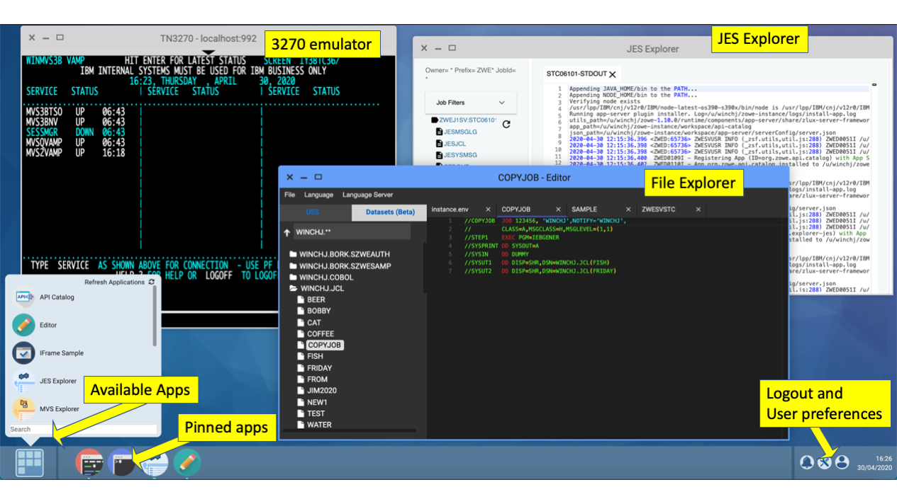

When the API Gateway is running, this server and the Desktop are accessible at `https://<ZOWE_HOST_ADDRESS>:7554/zlux/ui/v1/`.
When the API Catalog is running, this server's API documentation is accessible at the API Catalog tile `Zowe Application Server`, which can be viewed at `https://<ZOWE_HOST_ADDRESS>:7554/apicatalog/ui/v1/#/tile/zlux/zlux`.
When running on z/OS, this server uses the jobname suffix of DS1. 

## ZSS

Zowe System Services (ZSS) is a z/OS native, extensible HTTPS server which allows you to empower web programs with z/OS functionality due to ZSS' conveniences for writing REST and Websocket APIs around z/OS system calls. The Zowe desktop delegates a number of its services to the ZSS server.

When the API Gateway is running, this server is accessible at `https://<ZOWE_HOST_ADDRESS>:7554/zss/api/v1`.
When the API Catalog is running, this server's API documentation is accessible at the API Catalog tile `Zowe System Services (ZSS)` which can be viewed at `https://<ZOWE_HOST_ADDRESS>:7554/apicatalog/ui/v1/#/tile/zss/zss`
When running on z/OS, the server uses the jobname suffix of SZ.

## ZIS

ZIS is a z/OS native, authorized cross-memory server that allows a secure and convenient way for Zowe programs, primarily ZSS, to build powerful APIs to handle z/OS data that would otherwise be unavailable or insecure to access from higher-level languages and software. As part of Zowe's security model, this server is not accessible over a network but rather empowers the less privileged servers. It runs as a separate STC, `ZWESISTC` to run the program `ZWESIS01` under its own user ID `ZWESIUSR`.

Unlike all of the servers described above which run under the `ZWESLSTC` started task as address spaces for USS processes, the Cross Memory server has its own separate started task `ZWESISTC` and its own user ID `ZWESIUSR` that runs the program `ZWESIS01`.

## Desktop Apps

Zowe provides a number of rich GUI web applications for working with z/OS. Such applications include the Editor for files and datasets, the JES Explorer for jobs, and the IP Explorer for the TCPIP stack. You can access them through the Zowe desktop.

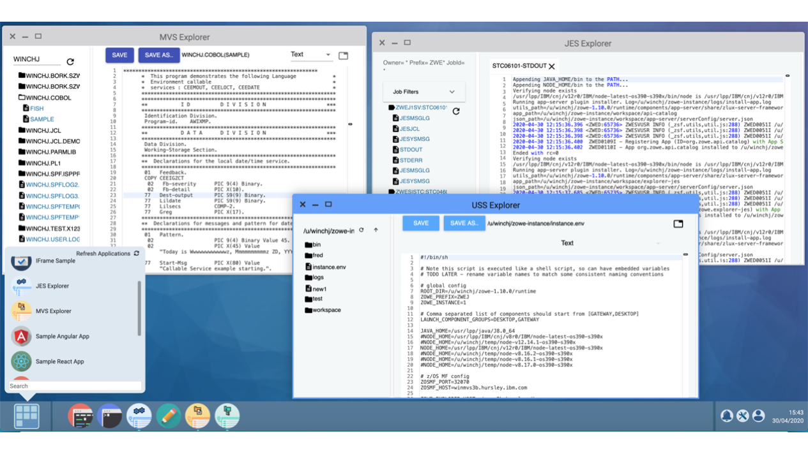

